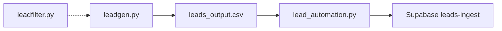

# cjm-dev Documentation

Documentation for Python automation in `scripts/` and `helper_scripts/`, plus unit tests.

For first-time setup, see [setup.md](setup.md). The root [README.md](../README.md) has a shorter setup checklist.

## Scripts

| Script | Doc |
|--------|-----|
| Blog automation (Chikara Realms) | [scripts/blog_automation.md](scripts/blog_automation.md) |
| Lead generation | [scripts/leadgen.md](scripts/leadgen.md) |
| Lead ingest | [scripts/lead_automation.md](scripts/lead_automation.md) |
| Lead filter (library) | [scripts/leadfilter.md](scripts/leadfilter.md) |
| Stock analyzer | [scripts/stock_analyzer.md](scripts/stock_analyzer.md) |
| Webhook manager | [scripts/webhook_manager.md](scripts/webhook_manager.md) |
| Lovable automation | [scripts/lovable_automation.md](scripts/lovable_automation.md) |
| Clip generator | [scripts/clip_generator.md](scripts/clip_generator.md) |
| Montage builder | [scripts/montage_builder.md](scripts/montage_builder.md) |
| JSON formatter | [scripts/json_formatter.md](scripts/json_formatter.md) |
| Email manager (library) | [scripts/email_manager.md](scripts/email_manager.md) |

## Helper scripts

| Module | Doc |
|--------|-----|
| API manager | [helper_scripts/api_manager.md](helper_scripts/api_manager.md) |
| Logger | [helper_scripts/logger.md](helper_scripts/logger.md) |
| Update manager (legacy) | [helper_scripts/update_manager.md](helper_scripts/update_manager.md) |

## Testing

| Topic | Doc |
|-------|-----|
| Unit tests | [testing/unittests.md](testing/unittests.md) |

## Lead pipeline

## Environment variables

| Variable | Used by |
|----------|---------|
| `CHATGPT_API_KEY` | `blog_automation`, `api_manager` |
| `PERPLEXITY_API_KEY` | `blog_automation`, `stock_analyzer`, `api_manager` |
| `CHIKARA_REALMS_SECRET` | `blog_automation`, `api_manager` |
| `GOOGLE_API_KEY` | `leadgen`, `api_manager` |
| `LEAD_INGEST_KEY` | `lead_automation`, `api_manager` |
| `APIFY_API_KEY` | `stock_analyzer`, `api_manager` |
| `APIFY_USER_ID` | `api_manager` |
| `STOCK_INGEST_TOKEN` | `stock_analyzer`, `api_manager` |
| `LOVABLE_API_KEY` | `lovable_automation` |
| `LOVABLE_WORKSPACE_ID` | `lovable_automation` (optional) |
| `LOVABLE_CREDIT_THRESHOLD` | `lovable_automation` (optional, default `5`) |
| `MOTO_VIDS_BASE` | `clip_generator`, `montage_builder` (optional) |

## Working directory cheat sheet

| Working directory | Scripts |
|-------------------|---------|
| `scripts/chikara_realms/` | `blog_automation.py` |
| `scripts/lead_automation/` | `leadgen.py`, `lead_automation.py` |
| `scripts/lovable_automation/` | `lovable_automation.py` |
| `scripts/json_formatter/` | `json_formatter.py` |
| `scripts/webhook_manager/` | `webhook_manager.py` |
| `scripts/video_editing/` | `clip_generator.py`, `montage_builder.py` |
| **Repo root** | `scripts/stock_analyzer/stock_analyzer.py` |
