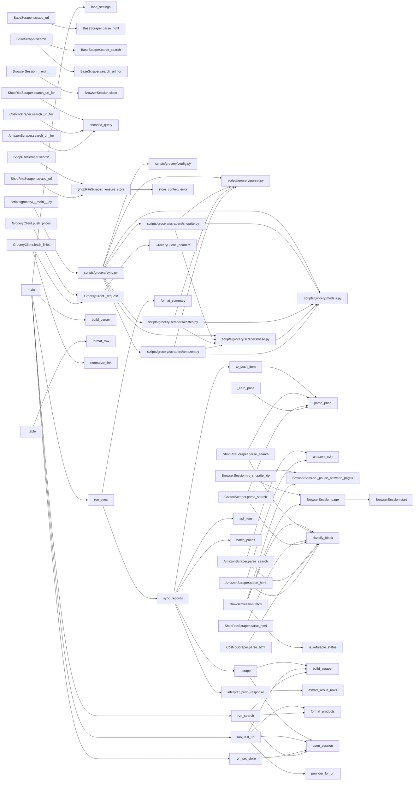

# Grocery

Imports followed two levels from the entry, plus in-module calls. Generated by `scripts/repo_map/generate.py`. Do not edit by hand.

```mermaid
flowchart LR
  scripts_grocery___main___py["scripts/grocery/__main__.py"]
  scripts_grocery_config_py["scripts/grocery/config.py"]
  scripts_grocery_config_py_load_settings["load_settings"]
  scripts_grocery_models_py["scripts/grocery/models.py"]
  scripts_grocery_parser_py["scripts/grocery/parser.py"]
  scripts_grocery_parser_py_parse_price["parse_price"]
  scripts_grocery_scrapers_amazon_py["scripts/grocery/scrapers/amazon.py"]
  scripts_grocery_scrapers_amazon_py_AmazonScraper_parse_html["AmazonScraper.parse_html"]
  scripts_grocery_scrapers_amazon_py_AmazonScraper_parse_search["AmazonScraper.parse_search"]
  scripts_grocery_scrapers_amazon_py_AmazonScraper_search_url_for["AmazonScraper.search_url_for"]
  scripts_grocery_scrapers_amazon_py__card_price["_card_price"]
  scripts_grocery_scrapers_amazon_py_amazon_asin["amazon_asin"]
  scripts_grocery_scrapers_base_py["scripts/grocery/scrapers/base.py"]
  scripts_grocery_scrapers_base_py_BaseScraper_parse_html["BaseScraper.parse_html"]
  scripts_grocery_scrapers_base_py_BaseScraper_parse_search["BaseScraper.parse_search"]
  scripts_grocery_scrapers_base_py_BaseScraper_scrape_url["BaseScraper.scrape_url"]
  scripts_grocery_scrapers_base_py_BaseScraper_search["BaseScraper.search"]
  scripts_grocery_scrapers_base_py_BaseScraper_search_url_for["BaseScraper.search_url_for"]
  scripts_grocery_scrapers_base_py_BrowserSession___exit["BrowserSession.__exit__"]
  scripts_grocery_scrapers_base_py_BrowserSession__pause_between_pages["BrowserSession._pause_between_pages"]
  scripts_grocery_scrapers_base_py_BrowserSession_close["BrowserSession.close"]
  scripts_grocery_scrapers_base_py_BrowserSession_fetch["BrowserSession.fetch"]
  scripts_grocery_scrapers_base_py_BrowserSession_page["BrowserSession.page"]
  scripts_grocery_scrapers_base_py_BrowserSession_start["BrowserSession.start"]
  scripts_grocery_scrapers_base_py_BrowserSession_try_shoprite_zip["BrowserSession.try_shoprite_zip"]
  scripts_grocery_scrapers_base_py_classify_block["classify_block"]
  scripts_grocery_scrapers_base_py_encoded_query["encoded_query"]
  scripts_grocery_scrapers_base_py_is_retryable_status["is_retryable_status"]
  scripts_grocery_scrapers_base_py_store_context_error["store_context_error"]
  scripts_grocery_scrapers_costco_py["scripts/grocery/scrapers/costco.py"]
  scripts_grocery_scrapers_costco_py_CostcoScraper_parse_html["CostcoScraper.parse_html"]
  scripts_grocery_scrapers_costco_py_CostcoScraper_parse_search["CostcoScraper.parse_search"]
  scripts_grocery_scrapers_costco_py_CostcoScraper_search_url_for["CostcoScraper.search_url_for"]
  scripts_grocery_scrapers_shoprite_py["scripts/grocery/scrapers/shoprite.py"]
  scripts_grocery_scrapers_shoprite_py_ShopRiteScraper__ensure_store["ShopRiteScraper._ensure_store"]
  scripts_grocery_scrapers_shoprite_py_ShopRiteScraper_parse_html["ShopRiteScraper.parse_html"]
  scripts_grocery_scrapers_shoprite_py_ShopRiteScraper_parse_search["ShopRiteScraper.parse_search"]
  scripts_grocery_scrapers_shoprite_py_ShopRiteScraper_scrape_url["ShopRiteScraper.scrape_url"]
  scripts_grocery_scrapers_shoprite_py_ShopRiteScraper_search["ShopRiteScraper.search"]
  scripts_grocery_scrapers_shoprite_py_ShopRiteScraper_search_url_for["ShopRiteScraper.search_url_for"]
  scripts_grocery_sync_py["scripts/grocery/sync.py"]
  scripts_grocery_sync_py_GroceryClient__headers["GroceryClient._headers"]
  scripts_grocery_sync_py_GroceryClient__request["GroceryClient._request"]
  scripts_grocery_sync_py_GroceryClient_fetch_links["GroceryClient.fetch_links"]
  scripts_grocery_sync_py_GroceryClient_push_prices["GroceryClient.push_prices"]
  scripts_grocery_sync_py__table["_table"]
  scripts_grocery_sync_py_api_item["api_item"]
  scripts_grocery_sync_py_batch_prices["batch_prices"]
  scripts_grocery_sync_py_build_parser["build_parser"]
  scripts_grocery_sync_py_build_scraper["build_scraper"]
  scripts_grocery_sync_py_extract_result_rows["extract_result_rows"]
  scripts_grocery_sync_py_format_products["format_products"]
  scripts_grocery_sync_py_format_row["format_row"]
  scripts_grocery_sync_py_format_summary["format_summary"]
  scripts_grocery_sync_py_interpret_push_response["interpret_push_response"]
  scripts_grocery_sync_py_main["main"]
  scripts_grocery_sync_py_normalize_link["normalize_link"]
  scripts_grocery_sync_py_open_session["open_session"]
  scripts_grocery_sync_py_provider_for_url["provider_for_url"]
  scripts_grocery_sync_py_run_search["run_search"]
  scripts_grocery_sync_py_run_set_store["run_set_store"]
  scripts_grocery_sync_py_run_sync["run_sync"]
  scripts_grocery_sync_py_run_test_url["run_test_url"]
  scripts_grocery_sync_py_scrape["scrape"]
  scripts_grocery_sync_py_sync_records["sync_records"]
  scripts_grocery_sync_py_to_push_item["to_push_item"]
  scripts_grocery___main___py --> scripts_grocery_sync_py
  scripts_grocery_scrapers_amazon_py --> scripts_grocery_models_py
  scripts_grocery_scrapers_amazon_py --> scripts_grocery_parser_py
  scripts_grocery_scrapers_amazon_py --> scripts_grocery_scrapers_base_py
  scripts_grocery_scrapers_base_py --> scripts_grocery_models_py
  scripts_grocery_scrapers_costco_py --> scripts_grocery_models_py
  scripts_grocery_scrapers_costco_py --> scripts_grocery_parser_py
  scripts_grocery_scrapers_costco_py --> scripts_grocery_scrapers_base_py
  scripts_grocery_scrapers_shoprite_py --> scripts_grocery_models_py
  scripts_grocery_scrapers_shoprite_py --> scripts_grocery_parser_py
  scripts_grocery_scrapers_shoprite_py --> scripts_grocery_scrapers_base_py
  scripts_grocery_sync_py --> scripts_grocery_config_py
  scripts_grocery_sync_py --> scripts_grocery_models_py
  scripts_grocery_sync_py --> scripts_grocery_parser_py
  scripts_grocery_sync_py --> scripts_grocery_scrapers_amazon_py
  scripts_grocery_sync_py --> scripts_grocery_scrapers_base_py
  scripts_grocery_sync_py --> scripts_grocery_scrapers_costco_py
  scripts_grocery_sync_py --> scripts_grocery_scrapers_shoprite_py
  scripts_grocery_scrapers_amazon_py_AmazonScraper_parse_html --> scripts_grocery_scrapers_base_py_classify_block
  scripts_grocery_scrapers_amazon_py_AmazonScraper_parse_search --> scripts_grocery_scrapers_base_py_classify_block
  scripts_grocery_scrapers_amazon_py_AmazonScraper_search_url_for --> scripts_grocery_scrapers_base_py_encoded_query
  scripts_grocery_scrapers_amazon_py__card_price --> scripts_grocery_parser_py_parse_price
  scripts_grocery_scrapers_costco_py_CostcoScraper_parse_html --> scripts_grocery_scrapers_base_py_classify_block
  scripts_grocery_scrapers_costco_py_CostcoScraper_parse_search --> scripts_grocery_scrapers_base_py_classify_block
  scripts_grocery_scrapers_costco_py_CostcoScraper_parse_search --> scripts_grocery_parser_py_parse_price
  scripts_grocery_scrapers_costco_py_CostcoScraper_search_url_for --> scripts_grocery_scrapers_base_py_encoded_query
  scripts_grocery_scrapers_shoprite_py_ShopRiteScraper__ensure_store --> scripts_grocery_scrapers_base_py_store_context_error
  scripts_grocery_scrapers_shoprite_py_ShopRiteScraper_parse_html --> scripts_grocery_scrapers_base_py_classify_block
  scripts_grocery_scrapers_shoprite_py_ShopRiteScraper_parse_search --> scripts_grocery_scrapers_base_py_classify_block
  scripts_grocery_scrapers_shoprite_py_ShopRiteScraper_parse_search --> scripts_grocery_parser_py_parse_price
  scripts_grocery_scrapers_shoprite_py_ShopRiteScraper_search_url_for --> scripts_grocery_scrapers_base_py_encoded_query
  scripts_grocery_sync_py_main --> scripts_grocery_config_py_load_settings
  scripts_grocery_sync_py_to_push_item --> scripts_grocery_parser_py_parse_price
  scripts_grocery_scrapers_amazon_py_AmazonScraper_parse_html --> scripts_grocery_scrapers_amazon_py_amazon_asin
  scripts_grocery_scrapers_amazon_py_AmazonScraper_parse_search --> scripts_grocery_scrapers_amazon_py_amazon_asin
  scripts_grocery_scrapers_base_py_BaseScraper_scrape_url --> scripts_grocery_scrapers_base_py_BaseScraper_parse_html
  scripts_grocery_scrapers_base_py_BaseScraper_search --> scripts_grocery_scrapers_base_py_BaseScraper_parse_search
  scripts_grocery_scrapers_base_py_BaseScraper_search --> scripts_grocery_scrapers_base_py_BaseScraper_search_url_for
  scripts_grocery_scrapers_base_py_BrowserSession___exit --> scripts_grocery_scrapers_base_py_BrowserSession_close
  scripts_grocery_scrapers_base_py_BrowserSession_fetch --> scripts_grocery_scrapers_base_py_BrowserSession__pause_between_pages
  scripts_grocery_scrapers_base_py_BrowserSession_fetch --> scripts_grocery_scrapers_base_py_BrowserSession_page
  scripts_grocery_scrapers_base_py_BrowserSession_fetch --> scripts_grocery_scrapers_base_py_classify_block
  scripts_grocery_scrapers_base_py_BrowserSession_fetch --> scripts_grocery_scrapers_base_py_is_retryable_status
  scripts_grocery_scrapers_base_py_BrowserSession_page --> scripts_grocery_scrapers_base_py_BrowserSession_start
  scripts_grocery_scrapers_base_py_BrowserSession_try_shoprite_zip --> scripts_grocery_scrapers_base_py_BrowserSession__pause_between_pages
  scripts_grocery_scrapers_base_py_BrowserSession_try_shoprite_zip --> scripts_grocery_scrapers_base_py_BrowserSession_page
  scripts_grocery_scrapers_shoprite_py_ShopRiteScraper_scrape_url --> scripts_grocery_scrapers_shoprite_py_ShopRiteScraper__ensure_store
  scripts_grocery_scrapers_shoprite_py_ShopRiteScraper_search --> scripts_grocery_scrapers_shoprite_py_ShopRiteScraper__ensure_store
  scripts_grocery_sync_py_GroceryClient__request --> scripts_grocery_sync_py_GroceryClient__headers
  scripts_grocery_sync_py_GroceryClient_fetch_links --> scripts_grocery_sync_py_GroceryClient__request
  scripts_grocery_sync_py_GroceryClient_fetch_links --> scripts_grocery_sync_py_normalize_link
  scripts_grocery_sync_py_GroceryClient_push_prices --> scripts_grocery_sync_py_GroceryClient__request
  scripts_grocery_sync_py__table --> scripts_grocery_sync_py_format_row
  scripts_grocery_sync_py_interpret_push_response --> scripts_grocery_sync_py_extract_result_rows
  scripts_grocery_sync_py_main --> scripts_grocery_sync_py_build_parser
  scripts_grocery_sync_py_main --> scripts_grocery_sync_py_run_search
  scripts_grocery_sync_py_main --> scripts_grocery_sync_py_run_set_store
  scripts_grocery_sync_py_main --> scripts_grocery_sync_py_run_sync
  scripts_grocery_sync_py_main --> scripts_grocery_sync_py_run_test_url
  scripts_grocery_sync_py_run_search --> scripts_grocery_sync_py_build_scraper
  scripts_grocery_sync_py_run_search --> scripts_grocery_sync_py_format_products
  scripts_grocery_sync_py_run_search --> scripts_grocery_sync_py_open_session
  scripts_grocery_sync_py_run_set_store --> scripts_grocery_sync_py_open_session
  scripts_grocery_sync_py_run_sync --> scripts_grocery_sync_py_format_summary
  scripts_grocery_sync_py_run_sync --> scripts_grocery_sync_py_sync_records
  scripts_grocery_sync_py_run_test_url --> scripts_grocery_sync_py_build_scraper
  scripts_grocery_sync_py_run_test_url --> scripts_grocery_sync_py_format_products
  scripts_grocery_sync_py_run_test_url --> scripts_grocery_sync_py_open_session
  scripts_grocery_sync_py_run_test_url --> scripts_grocery_sync_py_provider_for_url
  scripts_grocery_sync_py_scrape --> scripts_grocery_sync_py_build_scraper
  scripts_grocery_sync_py_scrape --> scripts_grocery_sync_py_open_session
  scripts_grocery_sync_py_sync_records --> scripts_grocery_sync_py_api_item
  scripts_grocery_sync_py_sync_records --> scripts_grocery_sync_py_batch_prices
  scripts_grocery_sync_py_sync_records --> scripts_grocery_sync_py_interpret_push_response
  scripts_grocery_sync_py_sync_records --> scripts_grocery_sync_py_scrape
  scripts_grocery_sync_py_sync_records --> scripts_grocery_sync_py_to_push_item
```
