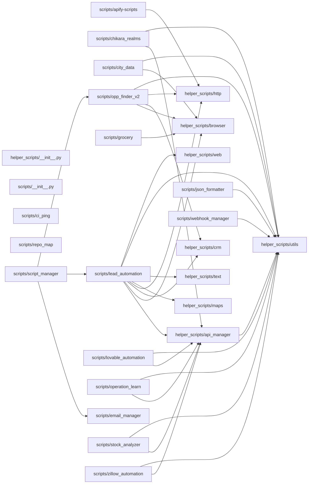

# Repository modules

Folder-level imports under scripts/ and helper_scripts/. Generated by `scripts/repo_map/generate.py`. Do not edit by hand.

```mermaid
flowchart LR
  helper_scripts___init___py["helper_scripts/__init__.py"]
  helper_scripts_api_manager["helper_scripts/api_manager"]
  helper_scripts_browser["helper_scripts/browser"]
  helper_scripts_crm["helper_scripts/crm"]
  helper_scripts_http["helper_scripts/http"]
  helper_scripts_maps["helper_scripts/maps"]
  helper_scripts_text["helper_scripts/text"]
  helper_scripts_utils["helper_scripts/utils"]
  helper_scripts_web["helper_scripts/web"]
  scripts___init___py["scripts/__init__.py"]
  scripts_apify_scripts["scripts/apify-scripts"]
  scripts_chikara_realms["scripts/chikara_realms"]
  scripts_ci_ping["scripts/ci_ping"]
  scripts_city_data["scripts/city_data"]
  scripts_email_manager["scripts/email_manager"]
  scripts_grocery["scripts/grocery"]
  scripts_json_formatter["scripts/json_formatter"]
  scripts_lead_automation["scripts/lead_automation"]
  scripts_lovable_automation["scripts/lovable_automation"]
  scripts_operation_learn["scripts/operation_learn"]
  scripts_opp_finder_v2["scripts/opp_finder_v2"]
  scripts_repo_map["scripts/repo_map"]
  scripts_script_manager["scripts/script_manager"]
  scripts_stock_analyzer["scripts/stock_analyzer"]
  scripts_webhook_manager["scripts/webhook_manager"]
  scripts_zillow_automation["scripts/zillow_automation"]
  helper_scripts_api_manager --> helper_scripts_utils
  scripts_apify_scripts --> helper_scripts_http
  scripts_chikara_realms --> helper_scripts_api_manager
  scripts_chikara_realms --> helper_scripts_utils
  scripts_city_data --> helper_scripts_browser
  scripts_city_data --> helper_scripts_utils
  scripts_grocery --> helper_scripts_browser
  scripts_json_formatter --> helper_scripts_utils
  scripts_lead_automation --> helper_scripts_api_manager
  scripts_lead_automation --> helper_scripts_browser
  scripts_lead_automation --> helper_scripts_crm
  scripts_lead_automation --> helper_scripts_http
  scripts_lead_automation --> helper_scripts_maps
  scripts_lead_automation --> helper_scripts_text
  scripts_lead_automation --> helper_scripts_utils
  scripts_lead_automation --> helper_scripts_web
  scripts_lovable_automation --> helper_scripts_api_manager
  scripts_lovable_automation --> helper_scripts_utils
  scripts_operation_learn --> helper_scripts_api_manager
  scripts_operation_learn --> helper_scripts_utils
  scripts_opp_finder_v2 --> helper_scripts_browser
  scripts_opp_finder_v2 --> helper_scripts_crm
  scripts_opp_finder_v2 --> helper_scripts_http
  scripts_opp_finder_v2 --> helper_scripts_utils
  scripts_script_manager --> scripts_email_manager
  scripts_script_manager --> scripts_lead_automation
  scripts_script_manager --> scripts_opp_finder_v2
  scripts_stock_analyzer --> helper_scripts_api_manager
  scripts_stock_analyzer --> helper_scripts_utils
  scripts_webhook_manager --> helper_scripts_utils
  scripts_zillow_automation --> helper_scripts_api_manager
  scripts_zillow_automation --> helper_scripts_utils
```
