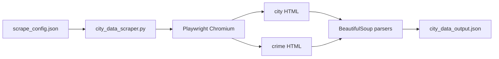

# City-data scraper

**Source:** `scripts/city_data/city_data_scraper.py`

## Purpose

Fetches city-data.com city profile and crime pages with Playwright, then extracts a curated JSON profile with BeautifulSoup. Input is a JSON config of cities and field groups.

City pages supply population, income, housing, cost of living, and education. Crime pages supply the City-Data crime index, yearly counts, and latest violent/property rates. If a crime URL 404s, the scraper falls back to the crime table on the city page when one exists.

## Prerequisites

- Python 3.12+
- `playwright`, `beautifulsoup4`
- `playwright install chromium`

No API keys. The script only requests `/city/` and `/crime/` paths (allowed by the site robots.txt). It does not hit disallowed endpoints and does not extract sex-offender lists.

## Configuration

| File | Description |
|------|-------------|
| `scrape_config.json` | Default input (cities, field groups, delay, timeout) |
| `city_data_output.json` | Output JSON object (created/overwritten on each run) |

Default `scrape_config.json`:

```json
{
  "delay_seconds": 1.5,
  "headless": true,
  "timeout_ms": 30000,
  "cities": [
    {"city": "Cherry Hill", "state": "NJ"},
    {"city": "Cinnaminson", "state": "NJ"}
  ],
  "fields": ["population", "income", "housing", "cost_of_living", "education", "crime"]
}
```

`fields` is an allowlist. Omit a group to skip it. `crime` is what triggers the second URL per city.

Optional per-city `slug` overrides the generated path token when city-data uses a different name (CDP vs township):

```json
{"city": "Cherry Hill", "state": "NJ", "slug": "Cherry-Hill-Mall"}
```

That becomes `/city/Cherry-Hill-Mall.html` instead of `/city/Cherry-Hill-New-Jersey.html`.

## How to run

```bash
cd scripts/city_data

# Use scrape_config.json
python city_data_scraper.py

# Custom input file and output path
python city_data_scraper.py --input scrape_config.json --output-path city_data_output.json

# Override cities and field groups without editing the file
python city_data_scraper.py --cities "Clementon,NJ" "Chicago,IL" --fields population crime
```

From repo root:

```bash
python scripts/city_data/city_data_scraper.py
```

### CLI flags

| Flag | Description |
|------|-------------|
| `--input PATH` | Config JSON (default `scrape_config.json`) |
| `--output-path PATH` | Profile destination (default `city_data_output.json`) |
| `--cities "City,ST" [...]` | Cities to scrape (overrides `--input`) |
| `--fields GROUP [...]` | Field groups to extract |
| `--delay FLOAT` | Seconds between HTTP requests |
| `--timeout-ms INT` | Playwright navigation timeout |
| `--headless` / `--no-headless` | Hide or show Chromium |

Flags overlay the input file. Unspecified flags leave the file values unchanged.

## How it works

1. Load config from `--input` (or built-in defaults if the file is missing).
2. Apply CLI overlays and require a non-empty `cities` list.
3. Open one Chromium browser. Block images, fonts, media, and common ad/analytics hosts. Wait for `domcontentloaded` only (maps never go idle).
4. For each city, fetch `/city/{City}-{State}.html`. If `crime` is requested, wait for `#crimeTab` when present, then fetch `/crime/crime-{City}-{State}.html` the same way. Yearly crime counts are read from that table (years as columns on the live site).
5. Parse HTML with BeautifulSoup. Missing keys are omitted. A failed city page sets `ok: false` and the run continues.
6. Write the JSON object atomically.



Example output:

```json
{
  "scraped_at": "2026-09-04T19:00:00+00:00",
  "results": [
    {
      "city": "Clementon",
      "state": "NJ",
      "urls": {
        "city": "https://www.city-data.com/city/Clementon-New-Jersey.html",
        "crime": "https://www.city-data.com/crime/crime-Clementon-New-Jersey.html"
      },
      "ok": true,
      "population": {"year": 2024, "total": 5600},
      "crime": {"index": 120.5, "index_year": 2024, "by_year": []}
    }
  ]
}
```

## Field groups

| Group | Source | Keys |
|-------|--------|------|
| `population` | City page | year, total, urban/rural %, change since 2000, median age, males, females |
| `income` | City page | year, median household, per capita, poverty rate |
| `housing` | City page | median home value, median gross rent, renter % |
| `cost_of_living` | City page | index, year |
| `education` | City page (age 25+) | HS or higher %, bachelor's or higher % |
| `crime` | Crime page, city table fallback | index, year, vs US average, YoY %, homicides, violent/property rates, officers per 1,000, `by_year` rows |

## Entry points

| Function | Used by | Behavior |
|----------|---------|----------|
| `scrape_cities(config, output_path, session=None)` | CLI / other scripts | Fetch, parse, write, return payload |
| `scrape_one(city_entry, fields, session)` | `scrape_cities` | One city + optional crime page |
| `parse_city_html(html, fields)` | `scrape_one` | Curated city-page groups |
| `parse_crime_html(html)` | `scrape_one` | Crime index and yearly table |
| `normalize_config(data)` | load / resolve | Validate cities, fields, timing |

## Related scripts

- [property_city_lookup.md](property_city_lookup.md) — address → demographics/crime GitHub Action envelope
- [property_listing_gen.md](property_listing_gen.md) — Zillow ZIP listing URLs for the same markets
- [leadgen.md](leadgen.md) — city coordinates used as the default NJ sample
