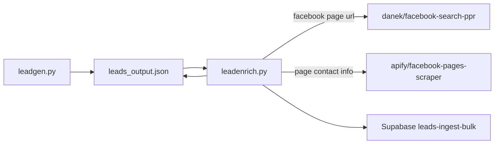

# Lead Enrichment (leadenrich)

**Source:** `scripts/lead_automation/leadenrich.py`

## Purpose

Fills in missing emails on leads produced by [leadgen](leadgen.md). Most Google Places leads have no email on their website (or have no website at all), but the business usually publishes one on its Facebook Page. For every lead with an empty `email`, this script resolves a Facebook Page URL, scrapes that page through Apify, and writes the email back into the leads JSON.

Runs two ways:

- **Automatically**, at the end of every leadgen run, while leadgen's `lead_enrichment` setting is on (the default). See [Lead enrichment](leadgen.md#lead-enrichment).
- **Standalone**, over an existing leads JSON file, using the CLI below.

## Prerequisites

- Python 3.12+
- `apify-client`, `python-dotenv`
- `APIFY_API_KEY` in repo-root `.env`
- `LEAD_INGEST_KEY` in repo-root `.env` (only for `--dashboard`)
- A leads JSON file from leadgen (default `leads_output.json`)

Both actors are paid per result. See [Apify actors](#apify-actors) for pricing links and [Cost control](#cost-control) before running against a large file.

## How to run

```bash
cd scripts/lead_automation

# Report which leads can be matched to a Facebook Page, without scraping or writing
python leadenrich.py --dry-run

# Enrich a capped number of leads (recommended first real run)
python leadenrich.py --limit 10

# Enrich everything and push newly enriched leads to the dashboard
python leadenrich.py --dashboard

# Work on a specific file and leave the original untouched
python leadenrich.py --json-path leads_output_20260803.json --output-path enriched.json
```

### CLI flags

| Flag | Description |
|------|-------------|
| `--json-path PATH` | Leads JSON from leadgen (default `leads_output.json`) |
| `--output-path PATH` | Write results here instead of overwriting the input file |
| `--limit INT` | Maximum leads to enrich this run; `0` (default) means no limit |
| `--min-similarity FLOAT` | Minimum business name similarity to accept a page match (default `0.72`) |
| `--max-search-results INT` | Facebook search results to consider per lead (default `5`) |
| `--max-workers INT` | Concurrent Facebook searches (default `4`) |
| `--retry-all` | Re-attempt every email-less lead, including ones already checked |
| `--dry-run` | Resolve and report page matches only; skip page scraping and writes |
| `--dashboard` | Bulk-ingest newly enriched leads via `send_to_dashboard` from leadgen |

## How it works

1. Load the leads JSON and select candidates: `email` is empty **and** the lead has not already been through enrichment (see [Re-runs](#re-runs)). Apply `--limit`.
2. Resolve a Facebook Page URL per candidate:
   - **From the lead website** when leadgen already stored a `facebook.com` URL there — free, no actor run.
   - **From Facebook search** otherwise: `danek/facebook-search-ppr` with `search_type: "pages"`, the business name as the query, and a `City, Country` hint parsed from the lead address. Searches run concurrently (`--max-workers`).
3. Score each search result's page name against the lead's business name and keep the best one above `--min-similarity` (see [Name matching](#name-matching)).
4. Scrape all resolved pages with `apify/facebook-pages-scraper` in batches of 25 `startUrls` — one actor run per batch, not per lead.
5. Pull an email out of each page's `email`, `intro`, `info`, `websites`, and `about_me` fields, discarding image filenames and junk domains (`facebook.com`, `sentry`, `wixpress`, …).
6. Write `email`, `has_email`, `facebook_url`, and an `enrichment` record onto each candidate, save the full file atomically, and optionally bulk-ingest the newly enriched leads.



## Entry points

| Function | Used by | Behavior |
|----------|---------|----------|
| `enrich_leads(leads, config=None)` | leadgen, in memory | Enriches a list of lead dicts in place; returns the rows that gained an email |
| `run_enrichment(config)` | the CLI | Loads the JSON file, calls `enrich_leads`, saves atomically, optional dashboard ingest |

leadgen imports `enrich_leads` lazily inside its own function, and this module imports `send_to_dashboard` from leadgen lazily, so neither import order creates a cycle.

## Apify actors

Both are registered in the `ACTORS` map of [api_manager](../helper_scripts/api_manager.md) and called by their friendly name.

| Friendly name | Actor ID | Used for |
|---------------|----------|----------|
| `Facebook Search` | [`danek/facebook-search-ppr`](https://apify.com/danek/facebook-search-ppr) | Find the Facebook Page URL for a business name |
| `Facebook Pages Scraper` | [`apify/facebook-pages-scraper`](https://apify.com/apify/facebook-pages-scraper) | Read email and contact details off a page |

The search actor returns `{type, name, url, profile_url, facebook_id, is_verified, image}` per result; only items typed `page` are considered. Result names and URLs are read through several key variants so a field rename upstream degrades to "no match" rather than a crash.

## URL resolution

`normalize_facebook_url` accepts a URL only if it looks like a page and rewrites it to a canonical form, so the same page found by two routes is never scraped twice.

| Input | Result |
|-------|--------|
| `https://m.facebook.com/CopperKettle/?ref=page_internal` | `https://www.facebook.com/CopperKettle` |
| `facebook.com/CopperKettle` | `https://www.facebook.com/CopperKettle` |
| `https://www.facebook.com/pg/CopperKettle/about` | `https://www.facebook.com/CopperKettle` |
| `https://www.facebook.com/pages/Joes-Plumbing/123456` | unchanged (legacy pages need the id) |
| `https://www.facebook.com/profile.php?id=61550…` | unchanged (newer pages have no vanity slug) |
| `/groups/…`, `/events/…`, `/watch/…`, bare `facebook.com` | rejected |

## Name matching

Facebook search returns loosely related pages, so a match is only accepted when the page name is close to the business name.

1. Both names are normalized: lowercased, apostrophes removed (`Joe's` → `joes`), punctuation collapsed, and legal/filler tokens dropped (`llc`, `inc`, `corp`, `the`, `and`, …).
2. Similarity is the higher of a `difflib` character ratio and a token containment score (`0.95 ×` the fraction of the shorter name's tokens present in the longer one). Containment covers the common case of a page named `Joes Plumbing - Cherry Hill NJ`, and is only applied when the shorter name has at least two tokens so that a single generic word like `plumbing` cannot match everything.
3. The best result must clear `--min-similarity` (default `0.72`); otherwise the lead is recorded as `no_page_match`.

## Output fields

Enriched leads keep every leadgen field and gain:

| Field | Description |
|-------|-------------|
| `email` | Email found on the Facebook Page (set only on success) |
| `has_email` | Flipped to `true` on success |
| `facebook_url` | Canonical page URL, set whenever one was resolved |
| `enrichment` | `{source, status, url_source, checked_at}` audit record |

`lead_score` is intentionally left alone: leadgen's scoring needs `has_cta`, which is not persisted in the leads JSON, so a recompute here would silently change unrelated inputs. Re-run leadgen if you need scores refreshed.

## Re-runs

| `enrichment.status` | Meaning | Re-attempted on the next run |
|---------------------|---------|------------------------------|
| `enriched` | Email found and written | No (the lead now has an email) |
| `no_page_match` | No search result cleared the similarity threshold | No |
| `no_email_on_page` | Page scraped, but it publishes no email | No |
| `scrape_failed` | The page scraper returned nothing for that URL | Yes (transient) |

Use `--retry-all` to force another pass over every email-less lead — for example after lowering `--min-similarity`. Everything else is skipped by default because re-running costs Apify credits and a page that has no email will not grow one.

## Cost control

- `--dry-run` resolves page URLs and prints the matches without running the page scraper or touching the file. Use it to sanity-check matching on a new niche before spending on scrapes.
- `--limit` caps how many leads are processed in a single run.
- `python leadgen.py --no-lead-enrichment` keeps enrichment out of a leadgen run entirely; enrich later in bulk from the JSON file.
- Leads whose website is already a Facebook Page skip the search actor entirely.
- Page scrapes are batched (25 URLs per actor run) and deduped by canonical URL.

## Related scripts

- [leadgen.md](leadgen.md) — produces the leads JSON this script enriches
- [lead_automation.md](lead_automation.md) — re-ingest existing leads to Supabase
- [api_manager.md](../helper_scripts/api_manager.md) — Apify actor runner and key resolution
- [testing/unittests.md](../testing/unittests.md) — unit tests for URL, matching, and merge logic
