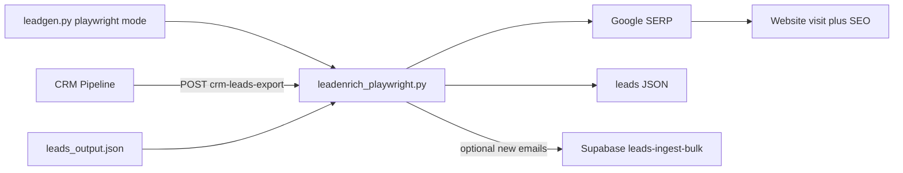

# Lead Enrichment (Playwright / Google)

**Source:** `scripts/lead_automation/leadenrich_playwright.py`

## Purpose

Researches leads in a Chromium browser: Google-search the business, classify Facebook pages / official websites / directories, visit the site, and write contact details plus an SEO/improvement audit. This is the Playwright-mode counterpart to Facebook/Apify enrichment in [leadenrich](leadenrich.md). It does **not** call Apify.

Runs two ways:

- **Automatically**, at the end of a [leadgen](leadgen.md) run when `leadgen_type` is `playwright` and `lead_enrichment` is on.
- **Standalone**, over a leads JSON file or by pulling Pipeline leads from the MV LLC CRM export API.

## Prerequisites

- Python 3.12+
- `playwright`, `beautifulsoup4`, `python-dotenv`, `httpx`
- `playwright install chromium`
- `LEAD_INGEST_KEY` in repo-root `.env` (required for `--from-crm` and `--dashboard`)

## How to run

```bash
cd scripts/lead_automation

# Research leads already in leads_output.json
python leadenrich_playwright.py --dry-run

# Cap a first real run
python leadenrich_playwright.py --limit 10

# Pull New Lead / Contacted rows from the CRM Pipeline and enrich them
python leadenrich_playwright.py --from-crm --limit 50

# Enrich CRM leads and push newly found emails back to the dashboard
python leadenrich_playwright.py --from-crm --dashboard --limit 25
```

### CLI flags

| Flag | Description |
|------|-------------|
| `--json-path PATH` | Leads JSON from leadgen (default `leads_output.json`) |
| `--output-path PATH` | Write results here instead of overwriting the input file |
| `--limit INT` | Maximum leads to enrich this run; `0` (default) means no limit |
| `--min-similarity FLOAT` | Minimum business name similarity to accept a Facebook match (default `0.72`) |
| `--max-queries INT` | Google searches per lead (default `4`) |
| `--retry-all` | Re-attempt every lead, including ones already researched |
| `--dry-run` | Google-search and report matches; skip site visits and writes |
| `--dashboard` | Bulk-ingest newly emailed leads via `send_to_dashboard` from leadgen |
| `--from-crm` | Pull Pipeline leads from `POST /crm-leads-export` instead of a JSON file |
| `--status TEXT` | CRM status filter (repeatable; default `New Lead` and `Contacted`) |
| `--category TEXT` | CRM category / source group filter |
| `--has-phone` | CRM: only leads that have a phone |
| `--missing-email` / `--no-missing-email` | CRM email filter (missing-email is the default) |
| `--min-score` / `--max-score` | CRM score range |
| `--search TEXT` | CRM text search |
| `--since YYYY-MM-DD` | CRM created-since filter |

## How it works

1. Select candidates: no completed Playwright enrichment yet, or `--retry-all` / retryable `scrape_failed`. Facebook-only enrichment records are not skipped — this pass still runs.
2. Google-search the business (name + city/state, plus `facebook` / `website` variants) using the same Playwright Google session as [email discovery](leadgen.md).
3. Classify SERP links: Facebook pages (name similarity), official websites (directory hosts skipped), and other listings stored as research notes.
4. Visit the website in the same Chromium session (requests fallback if Google has blocked the browser). Pull emails, phones, and social links; crawl contact/about paths when the homepage has no email.
5. Run a heuristic SEO audit on the rendered HTML (no extra SEO APIs).
6. Write `email`, `website`, `facebook_url`, `seo`, `research`, and an `enrichment` record. Save atomically. Optionally bulk-ingest rows that gained an email.



API Manager is used only for CRM export and optional dashboard write-back. Google and site visits use Playwright (or a requests fallback), not Apify.

## Entry points

| Function | Used by | Behavior |
|----------|---------|----------|
| `enrich_leads(leads, config=None, session=None)` | leadgen, in memory | Researches a list of lead dicts in place; returns rows that received a research record |
| `run_enrichment(config)` | the CLI | Loads JSON or CRM leads, calls `enrich_leads`, saves atomically, optional dashboard ingest |

leadgen imports `enrich_leads` lazily inside `enrich_missing_emails`, and this module imports `send_to_dashboard` from leadgen lazily, so neither import order creates a cycle.

## CRM Pipeline export

Standalone `--from-crm` posts to `https://bvkgatxfefnsfstwihxu.supabase.co/functions/v1/crm-leads-export` with `LEAD_INGEST_KEY` (`X-API-Key`). The body is JSON:

```json
{
  "format": "json",
  "status": ["New Lead", "Contacted"],
  "missing_email": true,
  "limit": 500,
  "offset": 0
}
```

Responses are paginated (`limit` / `offset` / `total`). CRM fields map onto leadgen rows (`phone` → `phone_google`, `score` → `lead_score`, `source_group_name` → `niche_key`, `id` → `crm_id`).

`--dashboard` re-ingests only rows that gained an email. SEO and research notes stay on the JSON row; the bulk ingest payload has no notes/SEO columns.

## SEO audit

`seo.score` is 0–100, **higher = more improvement opportunity** (same direction as leadgen `lead_score`). Checks include HTTPS, viewport, title and meta description length, a single H1, canonical, Open Graph, robots noindex, JSON-LD, image alt coverage, thin copy, CTA wording, and mixed-content HTTP assets.

Each audit also stores `issues[]` and `recommendations[]`.

## Output fields

| Field | Description |
|-------|-------------|
| `email` / `has_email` | Set when a new address is found on the site |
| `website` | Official site from the SERP or CRM, if it was empty |
| `facebook_url` | Canonical page URL when a confident match is found |
| `phone_website` | Phones scraped from the site when missing |
| `seo` | `{score, issues, recommendations, https, title, word_count}` |
| `research` | `{queries, links, load_ok, title, visit_via}` |
| `enrichment` | `{source: "playwright_google", status, url_source, checked_at}` |

## Re-runs

| `enrichment.status` | Meaning | Re-attempted next run |
|---------------------|---------|-----------------------|
| `enriched` | Email found and written | No |
| `researched` | Site and/or Facebook found; no new email | No |
| `no_match` | No confident site or Facebook page | No |
| `scrape_failed` | Research raised; treated as transient | Yes |

Use `--retry-all` to force another pass. High-volume leadgen keeps enrichment off so large Playwright discovery runs do not hammer Google.

## Related scripts

- [leadgen.md](leadgen.md) — calls this module when `leadgen_type` is `playwright`
- [leadenrich.md](leadenrich.md) — Facebook/Apify enrichment used in API Manager mode
- [api_manager.md](../helper_scripts/api_manager.md) — CRM export and dashboard ingest
- [testing/unittests.md](../testing/unittests.md) — unit tests (Google and CRM patched out)
