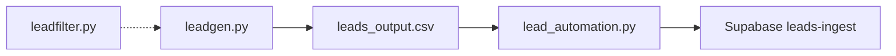

# Lead Generation (leadgen)

**Source:** `scripts/lead_automation/leadgen.py`

## Purpose

Discovers local business leads via Google Places Nearby Search, fetches place details, scrapes business websites for emails and quality signals, scores each lead, and appends results to a CSV. Skips duplicates (by `place_id`) and previously contacted emails.

## Prerequisites

- Python 3.12+
- `requests`, `pandas`, `beautifulsoup4`, `python-dotenv`
- `GOOGLE_API_KEY` in repo-root `.env`

## Configuration

| File | Description |
|------|-------------|
| `keywords.json` | Search keywords (keys used as categories) |
| `coords.json` | Lat/lng for search center |
| `leads_output.csv` | Output CSV (created/appended) |
| `contacted.txt` | Emails already contacted (skipped on export) |

Constants in the script: `SEARCH_RADIUS` (50 km), `MAX_WORKERS` (12), `PLACES_SLEEP` (2 s between API calls).

## How to run

```bash
cd scripts/lead_automation
python leadgen.py
```

No CLI arguments.

## How it works

1. Load keywords and coordinates from JSON.
2. For each keyword, call Google Places Nearby Search (with pagination).
3. For each new `place_id` (via [leadfilter](leadfilter.md)), fetch place details and website URL.
4. Scrape the website: emails, HTTPS, viewport meta, HTML length, CTA keywords.
5. Compute `lead_score` (lower is better; 0 = ideal lead).
6. Append qualifying rows to `leads_output.csv`.



## Related scripts

- [leadfilter.md](leadfilter.md) — duplicate filtering
- [lead_automation.md](lead_automation.md) — ingest CSV to Supabase
- [testing/unittests.md](../testing/unittests.md) — unit tests for scoring and parsing
