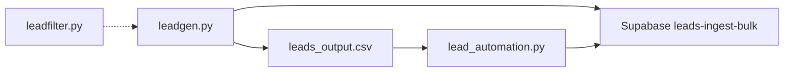

# Lead Generation (leadgen)

**Source:** `scripts/lead_automation/leadgen.py`

## Purpose

Discovers local business leads via Google Places Nearby Search, fetches place details, scrapes business websites for emails and quality signals, scores each lead, filters by minimum score, and outputs to CSV and/or the dashboard API. Skips duplicates (by `place_id`) and previously contacted emails.

## Prerequisites

- Python 3.12+
- `requests`, `pandas`, `beautifulsoup4`, `python-dotenv`
- `GOOGLE_API_KEY` in repo-root `.env`
- `LEAD_INGEST_KEY` in repo-root `.env` (required for dashboard output mode)

## Configuration

| File | Description |
|------|-------------|
| `keywords.json` | Search keywords (keys used as categories) |
| `coords.json` | Lat/lng for search center |
| `leads_output.csv` | Output CSV (created/appended) |
| `contacted.txt` | Emails already contacted (skipped on export) |

Defaults: `min_score` 80, `search_radius` 50 km, `max_workers` 12, `PLACES_SLEEP` 2 s between API calls.

## How to run

```bash
cd scripts/lead_automation

# Interactive menu (defaults or customize)
python leadgen.py

# Non-interactive with defaults
python leadgen.py --defaults

# Custom non-interactive
python leadgen.py --min-score 80 --output both --city "Cherry Hill"
```

### Interactive menu

```
=== Lead Generation ===
1) Run with defaults (min score 80, save to CSV, all locations & keywords)
2) Customize settings
3) Select locations & keywords
4) Exit
```

- **Option 1** — all locations from `coords.json`, all keywords from `keywords.json`, default min score and CSV output.
- **Option 2** — full wizard: min score, output mode, then keyword and location pickers.
- **Option 3** — keyword and location pickers only (defaults for everything else).

Both option 2 and 3 use grouped location and labeled keyword pickers:

**Locations** — cities listed under each state from `coords.json`:

```
--- Locations (coords.json) ---

NJ:
  1) Cherry Hill
  2) Cinnaminson
DE:
  3) Dover
```

**Keywords** — key and category label from `keywords.json`:

```
--- Keywords (keywords.json) ---

  1) landscaping  ->  landscaping-leads
  2) plumbing     ->  plumbing-leads
```

Enter comma-separated numbers to select specific items, or press Enter for all.

### CLI flags

| Flag | Description |
|------|-------------|
| `--defaults` | Skip menu, use defaults |
| `--min-score INT` | Minimum `lead_score` to keep (default 80) |
| `--output {csv,dashboard,both}` | Output destination |
| `--csv-path PATH` | CSV output path |
| `--keywords kw1 kw2` | Keyword subset from `keywords.json` |
| `--city "City Name"` | Filter to specific cities (repeatable) |

## How it works

1. Resolve configuration (interactive menu or CLI flags).
2. For each selected location and keyword, call Google Places Nearby Search (with pagination).
3. For each new `place_id` (via [leadfilter](leadfilter.md)), fetch expanded Place Details (`business_status`, `reviews`, phone, website).
4. Apply quality filters (operational status, review count, phone, review recency).
5. Scrape surviving websites: emails, HTTPS, viewport meta, HTML length, CTA keywords.
6. Compute normalized `lead_score` (0–100; higher = better outreach target).
7. Drop leads below `min_score`.
8. Save to CSV and/or bulk-ingest to dashboard API.


```mermaid
flowchart LR
  leadgen[leadgen.py] --> csv[leads_output.csv]
  leadgen --> supabase[Supabase leads-ingest-bulk]
  csv --> ingest[lead_automation.py]
  ingest --> supabase
  leadfilter[leadfilter.py] -.-> leadgen
```

## Quality filters

Applied after Place Details, before website scraping:

| Filter | Rule |
|--------|------|
| Business status | Exclude `CLOSED_TEMPORARILY` and `CLOSED_PERMANENTLY`; keep missing or `OPERATIONAL` |
| Review count | Require `user_ratings_total >= 3` |
| Phone | Require valid US-format `phone_google` from Google |
| Review recency | If review data exists, exclude when newest review is older than 18 months |

Place Details requests `business_status`, `reviews` (`reviews_sort=newest`), `rating`, and `user_ratings_total` in addition to website and phone.

## Scoring

`lead_score` is normalized to 0–100 based on applicable criteria. Higher scores mean better outreach targets.

| Criterion | Condition | Weight |
|-----------|-----------|--------|
| `no_website` | no website URL | 40 |
| `no_https` | has website, not HTTPS | 18 |
| `no_viewport` | has website, missing viewport meta | 14 |
| `short_html` | has website, `html_length < 5000` | 14 |
| `no_cta` | has website, no CTA keywords | 4 |
| `has_email` | scraped email present (bonus) | 6 |
| `low_rating` | `rating` is None or `< 4.5` | 1 |
| `low_reviews` | `user_ratings_total` is None or `< 15` | 1 |
| `unknown_status` | `business_status` missing (slight deprioritization) | 2 |

Leads without email are kept (cold-call queue). Leads with email score higher (warm email/SMS sequence). Output includes `has_email` and `business_status` columns.

Weights sum to 100. The final score is `round(raw / max_applicable * 100)`.

## Output modes

| Mode | Behavior |
|------|----------|
| `csv` | Append qualifying leads to `leads_output.csv` |
| `dashboard` | Bulk POST to `/leads-ingest-bulk` via `APIManager` |
| `both` | CSV save and dashboard ingest |

## Related scripts

- [leadfilter.md](leadfilter.md) — duplicate filtering
- [lead_automation.md](lead_automation.md) — re-ingest existing CSV to Supabase
- [testing/unittests.md](../testing/unittests.md) — unit tests for scoring and parsing
