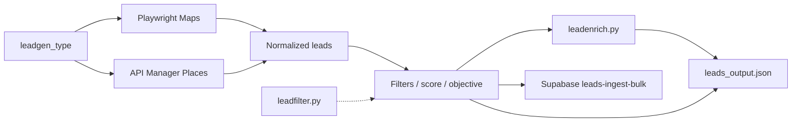

# Lead Generation (leadgen)

**Source:** `scripts/lead_automation/leadgen.py`

## Purpose

Discovers local business leads via either **Playwright** (browser-based Google Maps search) or **API Manager** (Google Places Nearby Search), then applies the same website analysis, scoring, hard `objective` contact requirement (`phone`, `email`, `either`, or `both`), and JSON/dashboard output. Skips duplicates (by `place_id` and related identity keys) and previously contacted emails.

The discovery provider is selected with `leadgen_type` (`playwright` or `api_manager`). Objectives, filters, enrichment, and CRM/output behavior are shared — only the initial business discovery path changes.

The `email` objective (and `either`/`both` when email is still missing) uses [email_discovery.py](../../scripts/lead_automation/email_discovery.py): Playwright Google searches plus a bounded website crawl. That path is slower by design; accuracy matters more than speed.

## Prerequisites

- Python 3.12+
- `requests`, `beautifulsoup4`, `python-dotenv`, `playwright`
- `playwright install chromium` (needed for `--objective email` / Google discovery)
- `GOOGLE_API_KEY` in repo-root `.env`
- `LEAD_INGEST_KEY` in repo-root `.env` (required for dashboard output mode)
- `APIFY_API_KEY` in repo-root `.env` (required while lead enrichment is on)

## Configuration

| File | Description |
|------|-------------|
| `keywords.json` | Search keywords (keys used as categories) |
| `coords.json` | Lat/lng for search center |
| `franchises.json` | Franchise/chain name and domain blocklists |
| `leadgen_settings.json` | Persisted run defaults (leadgen type, Playwright page limits, min score, reviews, franchise filter, `objective`, require website, lead enrichment, output, JSON path) |
| `leads_output.json` | Output JSON array (created/appended); includes `place_id` for cross-run dedupe |
| `contacted.txt` | Emails already contacted (skipped on export) |

Hardcoded fallbacks when no settings file exists: `leadgen_type` `api_manager` (preserves prior Places API behavior), `playwright_max_pages` 10, `playwright_max_results_per_search` 200, `min_score` 80, `min_reviews` 5, `filter_franchises` True, `search_radius` 50 km, `max_workers` 12, `PLACES_SLEEP` 2 s between API calls.

### Lead generation type

| Value | Discovery method |
|-------|------------------|
| `api_manager` (default) | Google Places Nearby Search + Place Details via `GOOGLE_API_KEY` |
| `playwright` | One Chromium browser scrapes Google Maps results with multi-page scrolling; **no Places API calls** for discovery or details |

Example `leadgen_settings.json` keys:

```json
{
  "leadgen_type": "playwright",
  "playwright_max_pages": 10,
  "playwright_max_results_per_search": 200
}
```

CLI equivalents:

```bash
python leadgen.py --leadgen-type playwright --playwright-max-pages 10 --defaults
python leadgen.py --leadgen-type api_manager --defaults
```

## How to run

```bash
cd scripts/lead_automation

# Interactive menu (run or customize defaults)
python leadgen.py

# Non-interactive with saved/hardcoded defaults
python leadgen.py --defaults

# Custom non-interactive
python leadgen.py --min-score 80 --output both --city "Cherry Hill"

# Contact objective (hard qualification after enrichment)
python leadgen.py --objective phone
python leadgen.py --objective email
python leadgen.py --objective either
python leadgen.py --objective both
```

### Interactive menu

```
=== Lead Generation ===
1) Run (min score …, output …; choose keywords & locations)
2) Customize settings (save defaults, do not run)
3) Exit
```

- **Option 1** — load `leadgen_settings.json` (or hardcoded defaults), always prompt for keywords and locations, confirm, then run.
- **Option 2** — prompt for min score, min reviews, franchise filter, objective (phone/email/either/both), require website, lead enrichment, output mode, and JSON path; write `leadgen_settings.json`; return to the menu without running. Keywords and locations are never persisted.

Keyword and location pickers wrap across the terminal width (horizontal listing under each state for cities).

**Locations** example:

```
--- Locations (coords.json) ---

NJ:
1) Cherry Hill  2) Cinnaminson
DE:
3) Dover
```

**Keywords** example:

```
--- Keywords (keywords.json) ---
1) landscaping -> landscaping-leads  2) plumbing -> plumbing-leads
```

Enter comma-separated numbers to select specific items, or press Enter for all.

### CLI flags

| Flag | Description |
|------|-------------|
| `--defaults` | Skip menu; use saved settings (if present) plus hardcoded fallbacks |
| `--leadgen-type {api_manager,playwright}` | Business discovery provider (default `api_manager`) |
| `--playwright-max-pages INT` | Max Maps result pages per keyword/location (Playwright; default 10) |
| `--playwright-max-results-per-search INT` | Cap businesses collected per keyword/location (Playwright; default 200) |
| `--min-score INT` | Minimum `lead_score` to keep (default 80) |
| `--min-reviews INT` | Minimum `user_ratings_total` (default 5) |
| `--filter-franchises` / `--no-filter-franchises` | Exclude (default) or allow franchise/chain leads |
| `--objective {phone,email,either,both}` | Hard contact requirement (default `phone`) |
| `--require-phone` / `--no-require-phone` | Legacy alias; combined with `--require-email` and normalized to `objective` |
| `--require-website` / `--no-require-website` | Require website URL (default off) |
| `--require-email` / `--no-require-email` | Legacy alias; combined with `--require-phone` and normalized to `objective` |
| `--lead-enrichment` / `--no-lead-enrichment` | Look up missing emails on Facebook after scraping (default on) |
| `--output {json,dashboard,both}` | Output destination |
| `--json-path PATH` | JSON output path |
| `--keywords kw1 kw2` | Keyword subset from `keywords.json` |
| `--city "City Name"` | Filter to specific cities (repeatable) |

CLI flags override values from `leadgen_settings.json`.

## How it works

1. Resolve configuration (interactive menu or CLI flags), including `leadgen_type`.
2. **Discover businesses** (provider switch only):
   - `api_manager` — for each selected location and keyword, call Google Places Nearby Search (with pagination), then Place Details.
   - `playwright` — for each keyword × location, open Google Maps in one shared Chromium browser, scroll/paginate up to `playwright_max_pages`, collect listings, then open each unique place panel for phone/website/address (no Places API).
3. Apply quality filters (operational status, review count, optional phone/website, review recency). Playwright skips closed-status when Maps does not expose it.
4. Scrape surviving websites: emails (regex + `mailto:` hrefs), HTTPS, viewport meta, HTML length, CTA keywords. Requests use a browser User-Agent; bare/HTTP URLs retry HTTPS when the body is empty or tiny. If the homepage has no email, also try `/contact`, `/contact-us`, `/contact.html`, `/about`, `/about-us`, and `/get-in-touch`.
5. If the objective still needs an email (or a phone for `both`), run Google/website discovery via [email_discovery.py](../../scripts/lead_automation/email_discovery.py). `--objective phone` skips this step and keeps the existing phone workflow.
6. Compute normalized `lead_score` (0–100; higher = better outreach target).
7. Drop leads below `min_score`.
8. Apply `lead_meets_objective` as a hard gate. A high score cannot override a missing required contact method.
9. When **lead enrichment** is on (default), hand the qualifying leads to [leadenrich](leadenrich.md) to look up missing emails on Facebook, then drop any lead whose newly found email is already in `contacted.txt`.
10. Save to JSON and/or bulk-ingest to dashboard API.


```mermaid
flowchart LR
  cfg[leadgen_type] --> pw[Playwright Maps]
  cfg --> api[API Manager Places]
  pw --> norm[Normalized leads]
  api --> norm
  norm --> filters[Filters / score / objective]
  filters --> enrich[leadenrich.py]
  enrich --> jsonOut[leads_output.json]
  filters --> jsonOut
  filters --> supabase[Supabase leads-ingest-bulk]
  leadfilter[leadfilter.py] -.-> filters
```

## Quality filters

Applied after Place Details, before website scraping:

| Filter | Rule |
|--------|------|
| Business status | Exclude `CLOSED_TEMPORARILY` and `CLOSED_PERMANENTLY`; keep missing or `OPERATIONAL` |
| Franchise / chain | When `filter_franchises` is True (default), exclude if `business_name` matches a name in `franchises.json` **or** website host matches a listed domain |
| Review count | Require `user_ratings_total >= min_reviews` (default 5) |
| Phone | When `objective` is `phone` (default), require valid US-format `phone_google` from Google. Other objectives do not early-reject on missing phone. |
| Website | When `require_website` is True (default False), require a non-empty Place Details `website` |
| Review recency | If review data exists, exclude when newest review is older than 18 months |

Applied after website scrape and optional Google email discovery:

| Filter | Rule |
|--------|------|
| Objective | `phone` requires a valid phone; `email` requires a valid email; `either` requires one of them; `both` requires both |

### Objective

`objective` is the only contact-requirement system. Legacy `--require-phone` / `--require-email` flags and old settings keys are migrated:

| Legacy flags | Objective |
|--------------|-----------|
| require phone, not email | `phone` |
| require email, not phone | `email` |
| both required | `both` |
| neither required | `either` |

`--objective` wins if both the new flag and the legacy flags are passed. Saved settings write `objective` only.

Place Details requests `business_status`, `reviews` (`reviews_sort=newest`), `rating`, `user_ratings_total`, website, phone, and `formatted_address`. Address falls back to Nearby Search `vicinity` when details address is empty.

Owner/decision-maker names are extracted from review text (patterns like "ask for X", "X was great", "X the owner") into an `owner_names` field. This is enrichment only — not a filter.

## Scoring

`lead_score` is normalized to 0–100 based on applicable criteria. Higher scores mean better outreach targets.

| Criterion | Condition | Weight |
|-----------|-----------|--------|
| `no_website` | no website URL | 40 |
| `no_https` | has website, not HTTPS | 18 |
| `no_viewport` | has website, missing viewport meta | 14 |
| `short_html` | has website, `html_length < 5000` | 14 |
| `no_cta` | has website, no CTA keywords | 4 |
| `has_email` | scraped email present (bonus) | 6 |
| `low_rating` | `rating` is None or `< 4.5` | 1 |
| `low_reviews` | `user_ratings_total` is None or `< 15` | 1 |
| `unknown_status` | `business_status` missing (slight deprioritization) | 2 |

Leads without email are kept when `objective` is `phone` or `either` (and a phone is present). Leads with email score higher (warm email/SMS sequence). Output includes `place_id`, `address`, `email`, `has_email`, `business_status`, and `owner_names` fields. Google discovery may also set `email_source` and `email_confidence`.

Weights sum to 100. The final score is `round(raw / max_applicable * 100)`.

## Lead enrichment

`lead_enrichment` (default **on**) runs [leadenrich](leadenrich.md) automatically at the end of a run, after scoring and filtering but before any output. Every qualifying lead that still has no email is looked up on Facebook and updated in place, so both the JSON file and the dashboard payload carry the enriched emails.

| Where | How to set it |
|-------|---------------|
| Interactive | Menu option 2 → *Lead enrichment (find missing emails on Facebook)* |
| CLI | `--lead-enrichment` / `--no-lead-enrichment` |
| Settings file | `"lead_enrichment": true` in `leadgen_settings.json` |

Notes:

- Enrichment needs `APIFY_API_KEY` and spends Apify credits per lead looked up. Turn it off with `--no-lead-enrichment` for cheap or exploratory runs, then enrich later in bulk with `python leadenrich.py`.
- Enrichment is best effort: if the Apify actors fail, the error is logged and the run still saves its leads.
- A lead whose enriched email already appears in `contacted.txt` is dropped, matching the behavior for emails found during the website scrape.

## Output modes

| Mode | Behavior |
|------|----------|
| `json` | Append qualifying leads to `leads_output.json` |
| `dashboard` | Bulk POST to `/leads-ingest-bulk` via `APIManager` |
| `both` | JSON save and dashboard ingest |

Sample bulk-ingest body: [leadgen_dashboard_sample.json](leadgen_dashboard_sample.json).

## Related scripts

- [leadfilter.md](leadfilter.md) — duplicate filtering
- [leadenrich.md](leadenrich.md) — fill in missing emails from Facebook Pages
- [lead_automation.md](lead_automation.md) — re-ingest existing CSV to Supabase
- [testing/unittests.md](../testing/unittests.md) — unit tests for scoring and parsing
