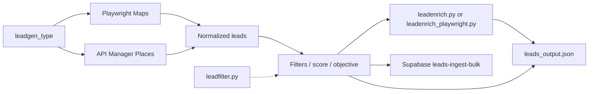

# Lead Generation (leadgen)

**Source:** `scripts/lead_automation/leadgen.py`

## Purpose

Discovers local business leads via either **Playwright** (browser-based Google Maps search) or **API Manager** (Google Places Nearby Search), then applies the same website analysis, scoring, hard `objective` contact requirement (`phone`, `email`, `either`, or `both`), and JSON/dashboard output. Skips duplicates (by `place_id` and related identity keys) and previously contacted emails.

The discovery provider is selected with `leadgen_type` (`playwright` or `api_manager`). Objectives, filters, enrichment, and CRM/output behavior are shared — only the initial business discovery path changes.

The `email` objective (and `either`/`both` when email is still missing) uses [email_discovery.py](../../scripts/lead_automation/email_discovery.py): Playwright Google searches plus a bounded website crawl. That path is slower by design; accuracy matters more than speed.

## Prerequisites

- Python 3.12+
- `requests`, `beautifulsoup4`, `python-dotenv`, `playwright`
- `playwright install chromium` (needed for `--objective email`, Playwright discovery, and Playwright enrichment)
- `GOOGLE_API_KEY` in repo-root `.env` (API Manager discovery)
- `LEAD_INGEST_KEY` in repo-root `.env` (required for dashboard output mode)
- `APIFY_API_KEY` in repo-root `.env` (required for Facebook enrichment in API Manager mode)

## Configuration

| File | Description |
|------|-------------|
| `keywords.json` | Search keywords (keys used as categories) |
| `coords.json` | Lat/lng for search center |
| `franchises.json` | Franchise/chain name and domain blocklists |
| `leadgen_settings.json` | Persisted run defaults (leadgen type, Playwright page limits, area expansion, skip-searched, history path, min score, reviews, franchise filter, `objective`, require website, lead enrichment, output, JSON path) |
| `leadgen_search_history.json` | Completed keyword×location×mode searches; used to skip repeat work |
| `leadgen_usage.json` | Cumulative Places Nearby/Details call counters (API Manager mode) |
| `leads_output.json` | Output JSON array (created/appended); includes `place_id` for cross-run dedupe |
| `contacted.txt` | Emails already contacted (skipped on export) |

Hardcoded fallbacks when no settings file exists: `leadgen_type` `api_manager` (preserves prior Places API behavior), `playwright_max_pages` 20, `playwright_max_results_per_search` 400, `playwright_area_expansion` `off`, `skip_searched` True, `search_history_path` `leadgen_search_history.json`, `min_score` 55, `min_reviews` 0, `filter_franchises` True, `search_radius` 50 km, `max_workers` 12, `PLACES_SLEEP` 2 s between API calls.

### Lead generation type

| Value | Discovery method |
|-------|------------------|
| `api_manager` (default) | Google Places Nearby Search + Place Details via `GOOGLE_API_KEY` |
| `playwright` | One Chromium browser scrapes Google Maps results with multi-page scrolling; **no Places API calls** for discovery or details. List cards already include phone/website/rating, so most place panels are skipped. Optional **area expansion** searches extra map cells around each city to get past Maps' ~120-result cap. |

### Search history (skip already-searched)

Each completed keyword × city × state × mode unit is stored in `leadgen_search_history.json` (radius or Playwright page limit + area expansion is part of the key). On later runs, matching units are skipped unless forced.

```json
{
  "leadgen_type": "playwright",
  "playwright_max_pages": 20,
  "playwright_max_results_per_search": 400,
  "playwright_area_expansion": "light",
  "skip_searched": true,
  "search_history_path": "leadgen_search_history.json"
}
```

```bash
python leadgen.py --leadgen-type playwright --playwright-max-pages 20 --defaults
python leadgen.py --leadgen-type playwright --playwright-area-expansion light --state NJ,PA --defaults
python leadgen.py --leadgen-type api_manager --defaults
python leadgen.py --force-research --defaults   # ignore history; re-run searches
```

## How to run

```bash
cd scripts/lead_automation

# Interactive menu (run or customize defaults)
python leadgen.py

# Non-interactive with saved/hardcoded defaults
python leadgen.py --defaults

# Custom non-interactive
python leadgen.py --min-score 80 --output both --city "Cherry Hill"

# Contact objective (hard qualification after enrichment)
python leadgen.py --objective phone
python leadgen.py --objective email
python leadgen.py --objective either
python leadgen.py --objective both
```

### Interactive menu

```
=== Lead Generation ===
  Current: playwright | objective=phone | min score 55 | output json

1) Run (choose keywords & locations)
2) Settings (save defaults, do not run)
3) High-volume preset (Playwright, area expansion, no Facebook enrich)
4) Exit
5) Lead Search (micro-niche intent search)
```

- **Option 1** — load `leadgen_settings.json` (or hardcoded defaults), prompt for keywords and locations with numbered submenus, show a volume estimate, then confirm (`Y` run, `n` cancel, `s` tweak settings).
- **Option 2** — numbered settings menu (enter a number to change one value, Enter to save). Writes `leadgen_settings.json` and returns to the menu without running. Keywords and locations are never persisted.
- **Option 3** — apply a high-volume Playwright preset (20 pages, 400 results/search, light area expansion, phone objective, min reviews 0, Facebook enrichment off) and optionally run.
- **Option 5** — [Niche Lead Search](niche_search.md): pick a micro-niche, search multiple queries, score website-prospect intent, then review/filter/export. Does not replace option 1.

**Keywords** — choose all, an industry group (home exterior, auto, professional, …), numbers/ranges (`1-8,12`), or a name search.

**Locations** — choose all cities, whole states (`NJ, PA` or state numbers), or city numbers/ranges.

The confirm screen estimates search count and typical unique-business yield so it is obvious when a run will produce hundreds vs thousands of leads.

### CLI flags

| Flag | Description |
|------|-------------|
| `--defaults` | Skip menu; use saved settings (if present) plus hardcoded fallbacks |
| `--leadgen-type {api_manager,playwright}` | Business discovery provider (default `api_manager`) |
| `--playwright-max-pages INT` | Max Maps result pages per keyword/location (Playwright; default 20) |
| `--playwright-max-results-per-search INT` | Cap businesses collected per keyword/location (Playwright; default 400) |
| `--playwright-area-expansion {off,light,dense}` | Extra map cells per city to exceed Maps' ~120 cap (default `off`) |
| `--skip-searched` | Skip keyword/location combos already in search history (default) |
| `--force-research` | Re-run searches even if present in history |
| `--search-history-path PATH` | Search history JSON path (default `leadgen_search_history.json`) |
| `--min-score INT` | Minimum `lead_score` to keep (default 80) |
| `--min-reviews INT` | Minimum `user_ratings_total` (default 5) |
| `--filter-franchises` / `--no-filter-franchises` | Exclude (default) or allow franchise/chain leads |
| `--objective {phone,email,either,both}` | Hard contact requirement (default `phone`) |
| `--require-phone` / `--no-require-phone` | Legacy alias; combined with `--require-email` and normalized to `objective` |
| `--require-website` / `--no-require-website` | Require website URL (default off) |
| `--require-email` / `--no-require-email` | Legacy alias; combined with `--require-phone` and normalized to `objective` |
| `--lead-enrichment` / `--no-lead-enrichment` | Post-scrape enrichment: Facebook in API mode, Google/Playwright in Playwright mode (default on) |
| `--output {json,dashboard,both}` | Output destination |
| `--json-path PATH` | JSON output path |
| `--keywords kw1 kw2` | Keyword subset from `keywords.json` |
| `--city "City Name"` | Filter to specific cities (repeatable) |
| `--state NJ` | Filter to coords.json state codes (repeatable, comma-separated OK) |
| `--niche ID` | Run [Niche Lead Search](niche_search.md) instead of the keyword job |
| `--review-leads` | Open the niche results reviewer |
| `--zip ZIP` | Extra ZIP locations for niche search (repeatable) |
| `--radius INT` | Niche search radius in meters |
| `--max-leads INT` | Cap ranked niche leads after scoring |
| `--min-rating FLOAT` | Minimum Google rating for niche search |
| `--website-requirement {any,none,weak_or_none,issue}` | Niche website filter |
| `--exclude-strong-websites` | Drop niche leads with a strong current website |
| `--extra-keywords ...` | Additional niche search queries |

CLI flags override values from `leadgen_settings.json`. Niche jobs write `niche_leads_output.json` by default and add `high-pri-lead` only for niches marked `high_pri_lead` in `niches.json`.

## How it works

1. **Initialize** — resolve configuration (interactive menu or CLI), including `leadgen_type` and `skip_searched`.
2. **Load prior state** — contacted emails, existing lead identities, and `leadgen_search_history.json`.
3. **Discover businesses** (provider switch only; skips history hits when `skip_searched` is on):
   - `api_manager` — for each selected location and pending keyword, call Google Places Nearby Search (with pagination), then Place Details.
   - `playwright` — for each pending keyword × location, open Google Maps in one shared Chromium browser, scroll/paginate up to `playwright_max_pages`, collect listings (phone/website/rating from the results cards), optionally search extra map cells when area expansion is on, then open place panels only when required fields are missing.
4. **Qualify & analyze** — quality filters, website scrape, optional email discovery, scoring, objective gate.
5. **Lead enrichment** (optional) — Facebook email lookup via [leadenrich](leadenrich.md) in API Manager mode, or Google/Playwright research via [leadenrich_playwright](leadenrich_playwright.md) in Playwright mode.
6. **Output** — JSON and/or dashboard ingest.
7. **Finalize** — append run summary to search history; update `leadgen_usage.json` when Places API calls were made.

Logs use `[STAGE n/7]` and `[STEP n.m]` markers (enrichment uses `[ENRICH STAGE]` / `[ENRICH STEP]`) so progress is visible at a glance.


```mermaid
flowchart LR
  cfg[leadgen_type] --> pw[Playwright Maps]
  cfg --> api[API Manager Places]
  pw --> norm[Normalized leads]
  api --> norm
  norm --> filters[Filters / score / objective]
  filters --> enrich[leadenrich.py or leadenrich_playwright.py]
  enrich --> jsonOut[leads_output.json]
  filters --> jsonOut
  filters --> supabase[Supabase leads-ingest-bulk]
  leadfilter[leadfilter.py] -.-> filters
```

## Quality filters

Applied after Place Details, before website scraping:

| Filter | Rule |
|--------|------|
| Business status | Exclude `CLOSED_TEMPORARILY` and `CLOSED_PERMANENTLY`; keep missing or `OPERATIONAL` |
| Franchise / chain | When `filter_franchises` is True (default), exclude if `business_name` matches a name in `franchises.json` **or** website host matches a listed domain |
| Review count | Require `user_ratings_total >= min_reviews` (default 5) |
| Phone | When `objective` is `phone` (default), require valid US-format `phone_google` from Google. Other objectives do not early-reject on missing phone. |
| Website | When `require_website` is True (default False), require a non-empty Place Details `website` |
| Review recency | If review data exists, exclude when newest review is older than 18 months |

Applied after website scrape and optional Google email discovery:

| Filter | Rule |
|--------|------|
| Objective | `phone` requires a valid phone; `email` requires a valid email; `either` requires one of them; `both` requires both |

### Objective

`objective` is the only contact-requirement system. Legacy `--require-phone` / `--require-email` flags and old settings keys are migrated:

| Legacy flags | Objective |
|--------------|-----------|
| require phone, not email | `phone` |
| require email, not phone | `email` |
| both required | `both` |
| neither required | `either` |

`--objective` wins if both the new flag and the legacy flags are passed. Saved settings write `objective` only.

Place Details requests `business_status`, `reviews` (`reviews_sort=newest`), `rating`, `user_ratings_total`, website, phone, and `formatted_address`. Address falls back to Nearby Search `vicinity` when details address is empty.

Owner/decision-maker names are extracted from review text (patterns like "ask for X", "X was great", "X the owner") into an `owner_names` field. This is enrichment only — not a filter.

## Scoring

`lead_score` is normalized to 0–100 based on applicable criteria. Higher scores mean better outreach targets.

| Criterion | Condition | Weight |
|-----------|-----------|--------|
| `no_website` | no website URL | 40 |
| `no_https` | has website, not HTTPS | 18 |
| `no_viewport` | has website, missing viewport meta | 14 |
| `short_html` | has website, `html_length < 5000` | 14 |
| `no_cta` | has website, no CTA keywords | 4 |
| `has_email` | scraped email present (bonus) | 6 |
| `low_rating` | `rating` is None or `< 4.5` | 1 |
| `low_reviews` | `user_ratings_total` is None or `< 15` | 1 |
| `unknown_status` | `business_status` missing (slight deprioritization) | 2 |

Leads without email are kept when `objective` is `phone` or `either` (and a phone is present). Leads with email score higher (warm email/SMS sequence). Output includes `place_id`, `address`, `email`, `has_email`, `business_status`, and `owner_names` fields. Google discovery may also set `email_source` and `email_confidence`.

Weights sum to 100. The final score is `round(raw / max_applicable * 100)`.

## Lead enrichment

`lead_enrichment` (default **on**) runs automatically at the end of a run, after scoring and filtering but before any output. Which enricher runs depends on `leadgen_type`:

| `leadgen_type` | Enricher | What it does |
|----------------|----------|--------------|
| `api_manager` | [leadenrich](leadenrich.md) | Facebook Page search + scrape via Apify; fills missing emails |
| `playwright` | [leadenrich_playwright](leadenrich_playwright.md) | Google search, site visit, Facebook/website discovery, SEO audit |

Qualifying leads are updated in place, so both the JSON file and the dashboard payload carry any newly found emails. Playwright enrichment also writes `seo`, `research`, and `facebook_url` onto the JSON rows.

| Where | How to set it |
|-------|---------------|
| Interactive | Menu option 2 → *Lead enrichment (Facebook)* or *Lead enrichment (Google/Playwright)* depending on type |
| CLI | `--lead-enrichment` / `--no-lead-enrichment` |
| Settings file | `"lead_enrichment": true` in `leadgen_settings.json` |

Notes:

- API Manager enrichment needs `APIFY_API_KEY` and spends Apify credits per lead. Playwright enrichment needs Chromium (`playwright install chromium`) and does not use Apify.
- Turn it off with `--no-lead-enrichment` for cheap or exploratory runs, then enrich later in bulk with `python leadenrich.py` or `python leadenrich_playwright.py`.
- The high-volume Playwright preset keeps enrichment off so large discovery runs do not hammer Google.
- Enrichment is best effort: if Apify or the browser fails, the error is logged and the run still saves its leads.
- A lead whose enriched email already appears in `contacted.txt` is dropped, matching the behavior for emails found during the website scrape.
- Playwright enrichment can also pull existing Pipeline leads via `python leadenrich_playwright.py --from-crm`.

## Output modes

| Mode | Behavior |
|------|----------|
| `json` | Append qualifying leads to `leads_output.json` |
| `dashboard` | Bulk POST to `/leads-ingest-bulk` via `APIManager` |
| `both` | JSON save and dashboard ingest |

Sample bulk-ingest body: [leadgen_dashboard_sample.json](leadgen_dashboard_sample.json).

## Related scripts

- [leadfilter.md](leadfilter.md) — duplicate filtering
- [leadenrich.md](leadenrich.md) — fill in missing emails from Facebook Pages (API Manager mode)
- [leadenrich_playwright.md](leadenrich_playwright.md) — Google/Playwright research and SEO audit (Playwright mode)
- [lead_automation.md](lead_automation.md) — re-ingest existing CSV to Supabase
- [testing/unittests.md](../testing/unittests.md) — unit tests for scoring and parsing
