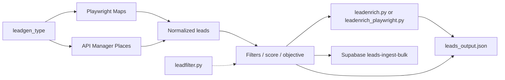

# Lead Generation (leadgen)

**Source:** `scripts/lead_automation/leadgen.py`

## Purpose

Discovers local business leads via either **Playwright** (browser-based Google Maps search) or **API Manager** (Google Places Nearby Search), then applies the same website analysis, scoring, hard `objective` contact requirement (`phone`, `email`, `either`, or `both`), and JSON/dashboard output. Skips duplicates (by `place_id` and related identity keys) and previously contacted emails.

The discovery provider is selected with `leadgen_type` (`playwright` or `api_manager`). Objectives, filters, enrichment, and CRM/output behavior are shared — only the initial business discovery path changes.

`--mode new-business` is a separate search on the same menu (option 6). It looks for newly registered or newly licensed businesses instead of keyword × Maps results. Standard mode (`--mode standard`, the default, and menu option 1) is unchanged. See [New-business discovery](#new-business-discovery) and [new_business_sources.md](new_business_sources.md).

The `email` objective (and `either`/`both` when email is still missing) uses [email_discovery.py](../../scripts/lead_automation/email_discovery.py): Playwright Google searches plus a bounded website crawl. That path is slower by design; accuracy matters more than speed.

## Prerequisites

- Python 3.12+
- `requests`, `beautifulsoup4`, `python-dotenv`, `playwright`
- `playwright install chromium` (needed for `--objective email`, Playwright discovery, and Playwright enrichment)
- `GOOGLE_API_KEY` in repo-root `.env` (API Manager discovery)
- `LEAD_INGEST_KEY` in repo-root `.env` (required for dashboard output mode)
- `APIFY_API_KEY` in repo-root `.env` (required for Facebook enrichment in API Manager mode)

## Configuration

| File | Description |
|------|-------------|
| `keywords.json` | Search keywords (keys used as categories) |
| `coords.json` | Lat/lng for search center. Cherry Hill is `39.9526,-75.1652`, which is the same point as Philadelphia (`39.952584,-75.165222`). Coordinate searches for Cherry Hill are centered on Philadelphia. Text queries (`{keyword} near {city}, {state}`) still say Cherry Hill. |
| `franchises.json` | Franchise/chain name and domain blocklists |
| `leadgen_settings.json` | Persisted run defaults (leadgen type, Playwright page limits, area expansion, skip-searched, history path, min score, reviews, franchise filter, `objective`, require website, lead enrichment, output, JSON path) |
| `leadgen_search_history.json` | Completed keyword×location×mode searches; used to skip repeat work |
| `leadgen_usage.json` | Cumulative Places Nearby/Details call counters (API Manager mode) |
| `leads_output.json` | Output JSON array (created/appended); includes `place_id` for cross-run dedupe |
| `contacted.txt` | Emails already contacted (skipped on export) |

Hardcoded fallbacks when no settings file exists: `leadgen_type` `api_manager` (preserves prior Places API behavior), `playwright_max_pages` 20, `playwright_max_results_per_search` 400, `playwright_area_expansion` `off`, `skip_searched` True, `search_history_path` `leadgen_search_history.json`, `min_score` 55, `min_reviews` 0, `filter_franchises` True, `search_radius` 50 km, `max_workers` 12, `PLACES_SLEEP` 2 s between API calls.

### Lead generation type

| Value | Discovery method |
|-------|------------------|
| `api_manager` (default) | Google Places Nearby Search + Place Details via `GOOGLE_API_KEY` |
| `playwright` | One Chromium browser scrapes Google Maps results with multi-page scrolling; **no Places API calls** for discovery or details. List cards already include phone/website/rating, so most place panels are skipped. Optional **area expansion** searches extra map cells around each city to get past Maps' ~120-result cap. |

### Search history (skip already-searched)

Each completed keyword × city × state × mode unit is stored in `leadgen_search_history.json` (radius or Playwright page limit + area expansion is part of the key). On later runs, matching units are skipped unless forced.

```json
{
  "leadgen_type": "playwright",
  "playwright_max_pages": 20,
  "playwright_max_results_per_search": 400,
  "playwright_area_expansion": "light",
  "skip_searched": true,
  "search_history_path": "leadgen_search_history.json"
}
```

```bash
python leadgen.py --leadgen-type playwright --playwright-max-pages 20 --defaults
python leadgen.py --leadgen-type playwright --playwright-area-expansion light --state NJ,PA --defaults
python leadgen.py --leadgen-type api_manager --defaults
python leadgen.py --force-research --defaults   # ignore history; re-run searches
```

## How to run

```bash
cd scripts/lead_automation

# Interactive menu (run or customize defaults)
python leadgen.py

# Non-interactive with saved/hardcoded defaults
python leadgen.py --defaults

# Custom non-interactive
python leadgen.py --min-score 80 --output both --city "Cherry Hill"

# Contact objective (hard qualification after enrichment)
python leadgen.py --objective phone
python leadgen.py --objective email
python leadgen.py --objective either
python leadgen.py --objective both
```

### Interactive menu

```
=== Lead Generation ===
  Current: playwright | objective=phone | min score 55 | output json

1) Run (choose keywords & locations)
2) Settings (save defaults, do not run)
3) High-volume preset (Playwright, area expansion, no Facebook enrich)
4) Exit
5) Lead Search (micro-niche intent search)
6) New-business discovery
```

- **Option 1** — keyword discovery. Forces `discovery_mode` to `standard` for that run, even if a saved setting says `new-business`. Load `leadgen_settings.json` (or hardcoded defaults), prompt for keywords and locations with numbered submenus, show a volume estimate, then confirm (`Y` run, `n` cancel, `s` tweak settings).
- **Option 2** — numbered settings menu (enter a number to change one value, Enter to save). Writes `leadgen_settings.json` and returns to the menu without running. Keywords and locations are never persisted.
- **Option 3** — apply a high-volume Playwright preset (20 pages, 400 results/search, light area expansion, phone objective, min reviews 0, Facebook enrichment off) and optionally run.
- **Option 5** — [Niche Lead Search](niche_search.md): pick a micro-niche, search multiple queries, score website-prospect intent, then review/filter/export. Does not replace option 1.
- **Option 6** — new-business discovery. Prompts for locations, max age, and minimum new-business score, then searches enabled public registration and license sources. Does not run the keyword Maps search. Dashboard output is refused.

**Keywords** — choose all, an industry group (home exterior, auto, professional, …), numbers/ranges (`1-8,12`), or a name search.

**Locations** — choose all cities, whole states (`NJ, PA` or state numbers), or city numbers/ranges.

The confirm screen estimates search count and typical unique-business yield so it is obvious when a run will produce hundreds vs thousands of leads.

### CLI flags

| Flag | Description |
|------|-------------|
| `--defaults` | Skip menu; use saved settings (if present) plus hardcoded fallbacks |
| `--leadgen-type {api_manager,playwright}` | Business discovery provider (default `api_manager`) |
| `--playwright-max-pages INT` | Max Maps result pages per keyword/location (Playwright; default 20) |
| `--playwright-max-results-per-search INT` | Cap businesses collected per keyword/location (Playwright; default 400) |
| `--playwright-area-expansion {off,light,dense}` | Extra map cells per city to exceed Maps' ~120 cap (default `off`) |
| `--skip-searched` | Skip keyword/location combos already in search history (default) |
| `--force-research` | Re-run searches even if present in history |
| `--search-history-path PATH` | Search history JSON path (default `leadgen_search_history.json`) |
| `--min-score INT` | Minimum `lead_score` to keep (default 80) |
| `--min-reviews INT` | Minimum `user_ratings_total` (default 5) |
| `--filter-franchises` / `--no-filter-franchises` | Exclude (default) or allow franchise/chain leads |
| `--objective {phone,email,either,both}` | Hard contact requirement (default `phone`) |
| `--require-phone` / `--no-require-phone` | Legacy alias; combined with `--require-email` and normalized to `objective` |
| `--require-website` / `--no-require-website` | Require website URL (default off) |
| `--require-email` / `--no-require-email` | Legacy alias; combined with `--require-phone` and normalized to `objective` |
| `--lead-enrichment` / `--no-lead-enrichment` | Post-scrape enrichment: Facebook in API mode, Google/Playwright in Playwright mode (default on) |
| `--output {json,csv,dashboard,both}` | Output destination. Standard mode: `both` is JSON + dashboard; `csv` warns and writes JSON. New-business mode: `both` is JSON + CSV; `dashboard` warns and writes JSON + CSV |
| `--json-path PATH` | JSON output path |
| `--keywords kw1 kw2` | Keyword subset from `keywords.json` |
| `--city "City Name"` | Filter to specific cities (repeatable) |
| `--state NJ` | Filter to coords.json state codes (repeatable, comma-separated OK) |
| `--niche ID` | Run [Niche Lead Search](niche_search.md) instead of the keyword job |
| `--review-leads` | Open the niche results reviewer |
| `--zip ZIP` | Extra ZIP locations for niche search (repeatable) |
| `--radius INT` | Niche search radius in meters |
| `--max-leads INT` | Cap ranked niche leads after scoring |
| `--min-rating FLOAT` | Minimum Google rating for niche search |
| `--website-requirement {any,none,weak_or_none,issue}` | Niche website filter |
| `--exclude-strong-websites` | Drop niche leads with a strong current website |
| `--extra-keywords ...` | Additional niche search queries |
| `--mode {standard,new-business}` | `standard` (default) is today's keyword discovery. `new-business` searches registration and license sources |
| `--max-age-days N` | New-business window (default 365) |
| `--very-new-days N` | Top newness tier (default 90) |
| `--sources a,b` | Source ids from `new_business_sources.json` (default: enabled verified sources) |
| `--list-sources` | Print id, category, coverage, status, enabled, and `check_access()`, then exit |
| `--county NAME` | Repeatable. Keep records whose source county matches |
| `--region NAME` | Repeatable. Select a region from `geo_regions.json` |
| `--regions-file PATH` | Region file (default `geo_regions.json`) |
| `--min-new-business-score N` | Minimum `new_business_score` (default 50) |
| `--score-rules PATH` | Path to `new_business_score_rules.json` |
| `--website-check {none,cheap,deep}` | Website classification depth (default `deep`). `none` leaves `website_status` as `unknown` |
| `--refresh-enrichment` | Ignore the email-enrichment cache TTL |
| `--include-seen` | Re-output businesses already written on a previous run |
| `--csv-path PATH` | New-business CSV path (default `new_business_leads.csv`) |
| `--max-records-per-source N` | Cap per source (default 200) |
| `--dry-run` | New-business fixtures only; no network |
| `--headful` | Show the browser for Playwright adapters |
| `--no-artifacts` | Do not write block/error captures under `new_business_artifacts/` |

CLI flags override values from `leadgen_settings.json`. Niche jobs write `niche_leads_output.json` by default and add `high-pri-lead` only for niches marked `high_pri_lead` in `niches.json`. `--zip` and `--radius` also apply in new-business mode (ZIP geocoding reuses niche search and needs `GOOGLE_API_KEY`, except `--dry-run`).

## How it works

1. **Initialize** — resolve configuration (interactive menu or CLI), including `leadgen_type` and `skip_searched`.
2. **Load prior state** — contacted emails, existing lead identities, and `leadgen_search_history.json`.
3. **Discover businesses** (provider switch only; skips history hits when `skip_searched` is on):
   - `api_manager` — for each selected location and pending keyword, call Google Places Nearby Search (with pagination), then Place Details.
   - `playwright` — for each pending keyword × location, open Google Maps in one shared Chromium browser, scroll/paginate up to `playwright_max_pages`, collect listings (phone/website/rating from the results cards), optionally search extra map cells when area expansion is on, then open place panels only when required fields are missing. After each city/state is searched and qualified, leads are saved/uploaded immediately (not held until the end of the run).
4. **Qualify & analyze** — quality filters, website scrape, optional email discovery, scoring, objective gate. Playwright does this per city, then prints location and running lead stats (unique, qualified, 55+, high-intent, website/email counts, saved, uploaded).
5. **Lead enrichment** (optional) — Facebook email lookup via [leadenrich](leadenrich.md) in API Manager mode, or Google/Playwright research via [leadenrich_playwright](leadenrich_playwright.md) in Playwright mode.
6. **Output** — JSON and/or dashboard ingest. Playwright already flushed each city; a final write happens only when enrichment updated rows.
7. **Finalize** — append run summary to search history; update `leadgen_usage.json` when Places API calls were made.

Logs use `[STAGE n/7]` and `[STEP n.m]` markers (enrichment uses `[ENRICH STAGE]` / `[ENRICH STEP]`) so progress is visible at a glance.


```mermaid
flowchart LR
  cfg[leadgen_type] --> pw[Playwright Maps]
  cfg --> api[API Manager Places]
  pw --> norm[Normalized leads]
  api --> norm
  norm --> filters[Filters / score / objective]
  filters --> enrich[leadenrich.py or leadenrich_playwright.py]
  enrich --> jsonOut[leads_output.json]
  filters --> jsonOut
  filters --> supabase[Supabase leads-ingest-bulk]
  leadfilter[leadfilter.py] -.-> filters
```

## Quality filters

Applied after Place Details, before website scraping:

| Filter | Rule |
|--------|------|
| Business status | Exclude `CLOSED_TEMPORARILY` and `CLOSED_PERMANENTLY`; keep missing or `OPERATIONAL` |
| Franchise / chain | When `filter_franchises` is True (default), exclude if `business_name` matches a name in `franchises.json` **or** website host matches a listed domain |
| Review count | Require `user_ratings_total >= min_reviews` (default 5) |
| Phone | When `objective` is `phone` (default), require valid US-format `phone_google` from Google. Other objectives do not early-reject on missing phone. |
| Website | When `require_website` is True (default False), require a non-empty Place Details `website` |
| Review recency | If review data exists, exclude when newest review is older than 18 months |

Applied after website scrape and optional Google email discovery:

| Filter | Rule |
|--------|------|
| Objective | `phone` requires a valid phone; `email` requires a valid email; `either` requires one of them; `both` requires both |

### Objective

`objective` is the only contact-requirement system. Legacy `--require-phone` / `--require-email` flags and old settings keys are migrated:

| Legacy flags | Objective |
|--------------|-----------|
| require phone, not email | `phone` |
| require email, not phone | `email` |
| both required | `both` |
| neither required | `either` |

`--objective` wins if both the new flag and the legacy flags are passed. Saved settings write `objective` only.

Place Details requests `business_status`, `reviews` (`reviews_sort=newest`), `rating`, `user_ratings_total`, website, phone, and `formatted_address`. Address falls back to Nearby Search `vicinity` when details address is empty.

Owner/decision-maker names are extracted from review text (patterns like "ask for X", "X was great", "X the owner") into an `owner_names` field. This is enrichment only — not a filter.

## Scoring

`lead_score` is normalized to 0–100 based on applicable criteria. Higher scores mean better outreach targets.

| Criterion | Condition | Weight |
|-----------|-----------|--------|
| `no_website` | no website URL | 40 |
| `no_https` | has website, not HTTPS | 18 |
| `no_viewport` | has website, missing viewport meta | 14 |
| `short_html` | has website, `html_length < 5000` | 14 |
| `no_cta` | has website, no CTA keywords | 4 |
| `has_email` | scraped email present (bonus) | 6 |
| `low_rating` | `rating` is None or `< 4.5` | 1 |
| `low_reviews` | `user_ratings_total` is None or `< 15` | 1 |
| `unknown_status` | `business_status` missing (slight deprioritization) | 2 |

Leads without email are kept when `objective` is `phone` or `either` (and a phone is present). Leads with email score higher (warm email/SMS sequence). Output includes `place_id`, `address`, `email`, `has_email`, `business_status`, and `owner_names` fields. Google discovery may also set `email_source` and `email_confidence`.

Weights sum to 100. The final score is `round(raw / max_applicable * 100)`.

## Lead enrichment

`lead_enrichment` (default **on**) runs automatically at the end of a run, after scoring and filtering but before any output. Which enricher runs depends on `leadgen_type`:

| `leadgen_type` | Enricher | What it does |
|----------------|----------|--------------|
| `api_manager` | [leadenrich](leadenrich.md) | Facebook Page search + scrape via Apify; fills missing emails |
| `playwright` | [leadenrich_playwright](leadenrich_playwright.md) | Google search, site visit, Facebook/website discovery, SEO audit |

Qualifying leads are updated in place, so both the JSON file and the dashboard payload carry any newly found emails. Playwright enrichment also writes `seo`, `research`, and `facebook_url` onto the JSON rows.

| Where | How to set it |
|-------|---------------|
| Interactive | Menu option 2 → *Lead enrichment (Facebook)* or *Lead enrichment (Google/Playwright)* depending on type |
| CLI | `--lead-enrichment` / `--no-lead-enrichment` |
| Settings file | `"lead_enrichment": true` in `leadgen_settings.json` |

Notes:

- API Manager enrichment needs `APIFY_API_KEY` and spends Apify credits per lead. Playwright enrichment needs Chromium (`playwright install chromium`) and does not use Apify.
- Turn it off with `--no-lead-enrichment` for cheap or exploratory runs, then enrich later in bulk with `python leadenrich.py` or `python leadenrich_playwright.py`.
- The high-volume Playwright preset keeps enrichment off so large discovery runs do not hammer Google.
- Enrichment is best effort: if Apify or the browser fails, the error is logged and the run still saves its leads.
- A lead whose enriched email already appears in `contacted.txt` is dropped, matching the behavior for emails found during the website scrape.
- Playwright enrichment can also pull existing Pipeline leads via `python leadenrich_playwright.py --from-crm`.

## Output modes

| Mode | Behavior |
|------|----------|
| `json` | Append qualifying leads to `leads_output.json` |
| `dashboard` | Bulk POST to `/leads-ingest-bulk` via `APIManager` |
| `both` | JSON save and dashboard ingest |

Playwright discovery writes each finished city/state immediately (`persist_lead_batch`). A later crash during another city does not lose the leads already qualified. Dashboard ingest retries transient DNS/connect errors and then continues the run; JSON is kept even when the upload misses.

Sample bulk-ingest body: [leadgen_dashboard_sample.json](leadgen_dashboard_sample.json).

## New-business discovery

Menu option 6, or:

```bash
python leadgen.py --mode new-business --defaults --state PA --city Philadelphia
python leadgen.py --list-sources
python leadgen.py --mode new-business --dry-run --defaults --state PA --city Philadelphia --output both
```

This mode does not call keyword Maps discovery and does not append to `leads_output.json`. It does not send anything to the dashboard and does not draft or send outreach.

### Geography

State and city come from `--state`, `--city`, and `coords.json`. ZIP and radius reuse `--zip` and `--radius` (`niche_search.expand_locations`). `--county` filters a county the source itself provided. `--region` reads `geo_regions.json`, which ships with an empty `regions` object:

```json
{
  "regions": {
    "example": {
      "state": "NJ",
      "counties": [],
      "cities": [],
      "zips": []
    }
  }
}
```

An empty `cities` list selects the whole state. No region is pre-filled. Records outside the selection are counted as `out_of_geography`. Records without enough location data to decide are kept with `geo_unverified: true`.

Cherry Hill in `coords.json` is `39.9526,-75.1652`. Philadelphia is `39.952584,-75.165222`. Maps and Places searches that use those coordinates are centered on Philadelphia. The text query still names Cherry Hill. The coordinates were left as they are.

### Sources

Adapters live in `scripts/lead_automation/new_business_sources/` and are listed in `new_business_sources.json`. Only sources with `enabled: true` and `status: "verified"` run by default. Candidates stay off until a public, free, robots-allowed endpoint with a real date is confirmed. Google Search is disabled because `robots.txt` disallows `/search`. Google Maps is used to verify phone, website, and status, not as proof that a business is new. A low review count is not a newness signal.

Per-source findings, terms, and how to add an adapter: [new_business_sources.md](new_business_sources.md).

### Scoring

`lead_score` is still the existing `score_lead` result. Ranking uses `new_business_score` from `new_business_scoring.py`. Points are in `new_business_score_rules.json`. The score is the sum of the breakdown, clamped to 0–100. Missing data adds 0. `--very-new-days`, `--max-age-days`, and `--min-new-business-score` override the day window and the cutoff. Point values stay in the rules file.

| `score_reasons` entry | Default points | Meaning |
|-----------------------|----------------|---------|
| `new_business_registered_90d` | +35 | Registration, formation, or filing date within `--very-new-days` (default 90). A license date does not use this tier |
| `new_business_registered` | +25 | Registration, formation, filing, license, or opening date within `--max-age-days` (default 365) |
| `recently_opened_signal` | +15 | Soft signal only (grand opening, now open, ribbon cutting, new chamber member, new license notice) |
| `no_website` | +30 | No business-owned site after the website search, or the URL is social/directory only |
| `broken_website` | +25 | Broken, placeholder, parked, or domain/hosting error |
| `poor_website` | +15 | Reachable site whose quality score is at least `poor_website_min_quality_score` (default 41) |
| `business_email_found` | +15 | Email accepted at HIGH or MEDIUM confidence |
| `public_phone_found` | +5 | Valid public US phone |
| `local_service_category` | +10 | Category matches a `keywords.json` key or `local_categories` in the rules file |
| `established_business` | −25 | Oldest reliable date is older than `established_after_days` (default 1095), or `user_ratings_total` is at least 50 |
| `good_website` | −15 | Reachable site with quality score 40 or below |
| `no_contact_info` | drop, or −20 | No accepted email, valid phone, or contact form. Dropped while `require_contact` is true |

`score_reasons` is ordered by points, highest first. `new_business_score` equals the clamped sum of `score_breakdown`.

Worked examples (as of 2026-10-05): registered 45 days ago with no website, an accepted email, a phone, and a keyword category scores 95. Registered 200 days ago with no website, phone only, and a category scores 70. A soft signal plus a poor site, phone, and category scores 45 and is dropped at the default cutoff of 50.

### Website status

Exactly one of `no_website`, `website_found`, `poor_website`, `good_website`, `unknown`. A registry row with no website field stays `unknown` until a website search runs. Social-only is `no_website` with `website_issues` containing `social_only`. `--website-check none` leaves the status `unknown`.

### Email

Enrichment runs when `lead_enrichment` is on, including when `objective` is `phone`. Order: source record, business website (contact, about, footer, mailto), then Google query templates capped at the existing five searches. Addresses are kept only when `score_email_confidence` is HIGH or MEDIUM. Nothing is guessed or SMTP-probed. `email_source` is one of `source_record`, `website_contact`, `website_about`, `website_footer`, `website_mailto`, `directory`, `google_result`, `social_profile`, `other`, with `email_source_url` and `email_evidence`. Results are cached in `new_business_enrichment_cache.json` for `nb_enrichment_ttl_days` (default 30) unless `--refresh-enrichment` is set. A lead with no email is kept when it has a valid phone or a public contact-form URL.

### Deduplication and output

The same business from a registry, Maps, and a website is one row. Matching uses entity id, place id, Maps URL, or website domain (exact), or phone plus a similar name, or the same normalized name plus ZIP or street (strong). Same name in the same city only is flagged with `possible_duplicate_of` and not merged. Name alone never merges. `new_business_seen.json` suppresses businesses already output unless `--include-seen` is set. Rows already in `leads_output.json` or `contacted.txt` are skipped.

JSON default: `new_business_leads.json` (`--json-path`). CSV default: `new_business_leads.csv` (`--csv-path`). Lists in the CSV are joined with ` | `. `score_breakdown`, `newness_evidence`, and `sources` are JSON strings. A sidecar `new_business_run_<timestamp>.json` records per-source status and drop counts (`franchise`, `inactive_or_closed`, `no_contact_info`, `below_min_score`, `out_of_geography`, `already_seen`, `established_business`).

### Politeness

Sources run one at a time, one request per host, with a random delay (default 3–7 seconds). `robots.txt` is checked before an HTTP or Playwright fetch; a disallow sets `robots_disallowed` and skips the source. A CAPTCHA, block, or login page stops that source for the rest of the run and writes `new_business_artifacts/<run_ts>/<source_id>/`. Network errors, HTTP 429, and 5xx retry up to twice. Paid records and logins are not used. One source failing does not abort the run.

## Related scripts

- [leadfilter.md](leadfilter.md) — duplicate filtering
- [leadenrich.md](leadenrich.md) — fill in missing emails from Facebook Pages (API Manager mode)
- [leadenrich_playwright.md](leadenrich_playwright.md) — Google/Playwright research and SEO audit (Playwright mode)
- [lead_automation.md](lead_automation.md) — re-ingest existing CSV to Supabase
- [new_business_sources.md](new_business_sources.md) — new-business source verification and how to add an adapter
- [testing/unittests.md](../testing/unittests.md) — unit tests for scoring and parsing
